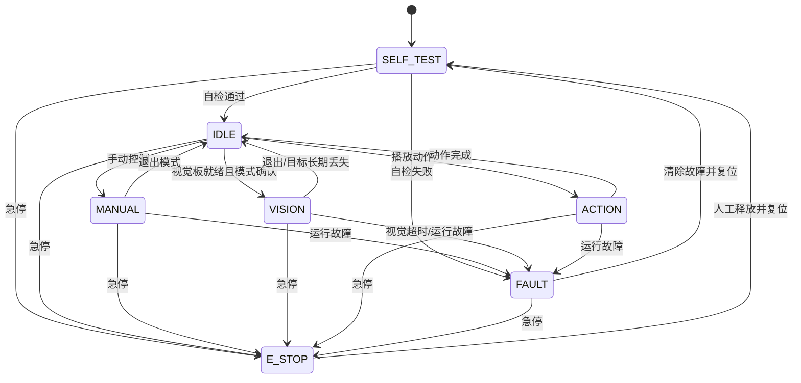
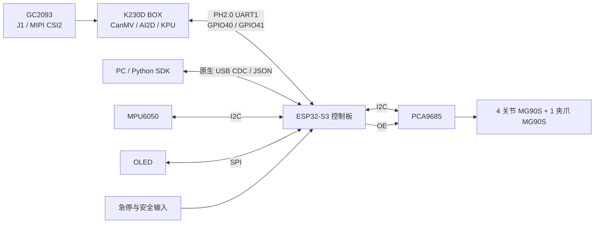
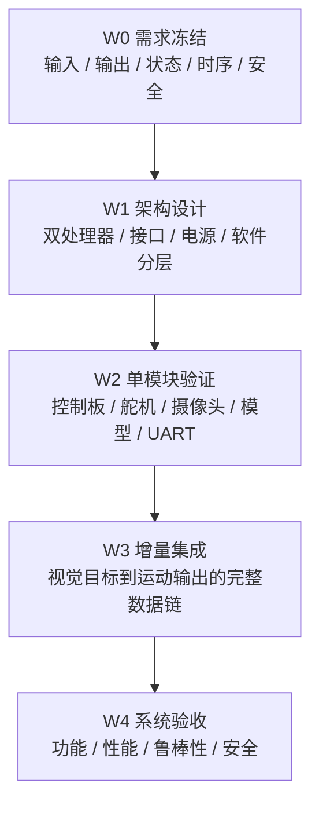

# CyberArm 视觉追踪桌面机械臂设计文档

> 视觉平台：正点原子 K230D BOX<br>
> 控制平台：ESP32-S3<br>
> 文档日期：2026 年 9 月

## 文档概述

CyberArm 是一台面向桌面交互场景的可编程视觉机械臂。系统包含四个关节运动轴和一路夹爪执行轴，能够通过视觉、姿态传感器或上位机指令获得输入，完成目标跟踪、手势响应、动作播放和姿态镜像等任务。

系统采用正点原子 K230D BOX 作为独立视觉处理器，ESP32-S3 作为实时运动与安全控制器。K230D BOX 负责图像采集、人脸检测、手部关键点和目标检测，ESP32-S3 负责状态管理、运动规划和舵机控制。两块处理器通过 UART 交换结构化视觉结果，使高计算量视觉任务与确定性控制任务彼此隔离。

本文档定义系统功能、软硬件架构、处理器分工、视觉管线、通信协议、安全机制及开发与验收流程。文档中的性能数值属于设计目标，最终结果以样机测试记录为准。

# 1 系统功能

CyberArm 定位为一台可编程的视觉交互桌面机械臂。系统可以根据摄像头画面、MPU6050 姿态数据或上位机命令切换工作模式。视觉任务在 K230D BOX 上运行，状态管理、运动规划和舵机控制在 ESP32-S3 上运行。

除预置模式外，机械臂还通过 ESP32-S3 原生 USB 接口向上位机开放控制能力。用户可使用 Python SDK 组合关节运动、末端移动、模式切换、动作播放和状态查询等功能。

## 1.1 四个核心模块

系统按功能划分为以下四个模块。

1. **运动执行**

   五路 MG90S 舵机分别驱动底座、肩、肘、腕和夹爪。上位机可以直接给出关节角，也可以给出末端目标坐标，由 ESP32-S3 的逆运动学模块计算可行关节配置。所有目标都要经过工作空间、关节限位、最大速度和轨迹平滑检查。

2. **视觉感知**

   正点原子 K230D BOX 使用标配 GC2093 摄像头采集图像，通过 CanMV、AI2D 和 KPU 完成人脸、手掌、手部关键点、物体及手势的检测与跟踪。视觉侧只输出目标类别、坐标、边界框、置信度、帧序号和时间戳，不直接输出舵机角度。

3. **可编程接口**

   自配置控制板引出 ESP32-S3 原生 USB 接口，固件通过 USB CDC 提供按行分隔的 JSON 消息。Python SDK 负责串口连接、消息编解码、超时处理和事件回调。K230D BOX 与 ESP32-S3 之间另设二进制 UART 协议，避免视觉数据和上位机日志混流。

4. **交互与反馈**

   K230D BOX 板载 2.4 英寸 640 × 480 触摸屏，用于显示相机画面、检测框、视觉模式和帧率；ESP32-S3 侧 OLED 显示机械臂模式、控制链路、急停和故障码。MPU6050 可作为独立姿态输入，在镜像模式下将横滚角和俯仰角映射到部分关节。

## 1.2 五种交互模式

系统设计包含五种交互模式。模式切换由 ESP32-S3 状态机统一管理；切换时清空上一模式的视觉滤波状态、待执行目标和未完成命令。

### 1.2.1 人脸追踪

K230D BOX 运行人脸检测模型，选择置信度最高或由用户锁定的人脸作为目标。视觉侧对人脸框中心进行短时跟踪和滤波，向 ESP32-S3 输出归一化中心坐标。ESP32-S3 根据目标相对画面中心的偏差调整底座和俯仰关节，使机械臂朝向目标。

连续若干帧未检测到目标时，系统停止跟踪并减速回到等待姿态。机械臂不得继续使用过期的人脸坐标。

### 1.2.2 指尖追踪

K230D BOX 先运行手掌检测，再在手掌区域内运行手部关键点模型，以食指末端关键点作为跟踪目标。检测与关键点定位结果共同用于判断目标有效性，并通过滤波抑制坐标抖动。

指尖追踪范围限定为桌面标定平面内的位置变化，目标高度使用预设值。空间追踪作为扩展功能，需要增加深度信息。

### 1.2.3 物体追踪

系统提供两类物体追踪能力：

- 对颜色单一、背景可控的物体，K230D 使用颜色阈值、形态学处理和连通域质心进行定位。
- 对杯子、瓶子、手机等通用类别，K230D 使用 YOLOv8n 等目标检测模型输出类别、边界框和置信度。

检测结果经过跟踪与稳定性判断后才发送给 ESP32-S3。若要完成抓取，还需要预先设定抓取高度、夹爪动作和接近路径。

### 1.2.4 手势指令

K230D BOX 使用手掌检测和手部关键点分类识别静态手势，也可扩展动态手势模型。识别结果必须连续多帧一致，或满足规定持续时间，才生成一次离散事件。ESP32-S3 对事件序号去重，再调用对应动作；单帧误识别不得直接触发机械臂动作。

### 1.2.5 镜像复现

MPU6050 固定在前臂或手腕处，通过有线 I²C 原型或外接无线节点向 ESP32-S3 提供姿态数据。系统融合加速度计和陀螺仪估计横滚角、俯仰角，并按标定比例映射到指定关节。

单个六轴 IMU 缺少绝对航向参考，也无法恢复人体肩、肘各自姿态，因此该模式实现有限自由度动作映射，不宣称严格的一比一动作捕捉。

## 1.3 可编程能力

固件将移动、关节控制、视觉配置、传感器读取、动作播放和状态查询抽象为相对独立的服务。PC 端 Python SDK 通过 ESP32-S3 原生 USB 提供统一接口，使演示程序可以在不修改底层固件的情况下组合这些能力。

SDK 设计范围控制在约 20 个核心方法内，包含：

- 末端坐标移动；
- 单关节与多关节控制；
- 夹爪开合；
- 视觉模式选择与视觉状态查询；
- 单次检测结果查询；
- 动作序列上传与播放；
- 标定参数管理；
- 急停、复位和故障查询；
- 异步事件回调。

K230D BOX 不是上位机的第二个控制入口。上位机先向 ESP32-S3 请求视觉模式，ESP32-S3 再通过 UART 配置 K230D，以确保系统中只有一个状态与控制权裁决者。

## 1.4 系统工作状态

主状态机由 ESP32-S3 管理：



K230D BOX 另有视觉子状态：

```text
OFF → BOOTING → READY → TRACKING
                  ↘ DEGRADED / FAULT
```

只有当 K230D BOX 完成启动握手、模型加载和心跳上报后，主状态机才允许进入 `VISION`。任一运行状态都可以转入 `FAULT` 或 `E_STOP`。

## 1.5 功能实现快速索引

| 功能 | 输入 | 主要算法或逻辑 | 输出 |
| --- | --- | --- | --- |
| 点到点运动 | 桌面坐标 $(x,y,z)$ | 逆运动学、解选择、限位检查、轨迹插值 | 四个运动关节协同动作 |
| 人脸追踪 | K230D 人脸框和置信度 | KPU 人脸检测、目标选择、EMA/跟踪、死区 | 底座和俯仰关节调整 |
| 指尖追踪 | K230D 手掌框和关键点 | 手掌检测、关键点推理、食指末端提取 | 末端跟随标定平面内目标 |
| 颜色物体追踪 | K230D 颜色目标质心 | 阈值、形态学、连通域、短时跟踪 | 跟随指定颜色物体 |
| 类别物体追踪 | K230D 检测框和类别 | YOLOv8n、NMS、目标选择和跟踪 | 跟随指定类别物体 |
| 手势识别 | K230D 手部关键点/时序结果 | 多帧确认、事件去重 | 触发预置动作 |
| 镜像复现 | MPU6050 姿态 | 姿态解算、偏置校准、角度映射 | 有限自由度姿态映射 |
| 动作库 | 预存关键帧序列 | 关节空间插值、限速和超时 | 预置及自定义动作 |
| PC 脚本 | USB CDC JSON | Python SDK、响应匹配和事件回调 | 组合控制与状态记录 |

# 2 硬件设计

## 2.1 总体架构

系统采用“K230D BOX 视觉处理器 + ESP32-S3 实时控制器”的双处理器架构。



ESP32-S3 控制板围绕 ESP32-S3-WROOM-1-N16R8 模组设计，模组集成 16 MB Flash 和 8 MB PSRAM。控制板提供原生 USB、PCA9685、MPU6050、OLED 和五路 MG90S 接口，并通过板间 UART 连接 K230D BOX 的 UART1。摄像头采集与图像缓冲由 K230D BOX 管理。

正点原子 K230D BOX 采用 DNK230D 底板与 CNK230DF 核心板组合，K230D 内置 128 MB LPDDR4。板卡自带 GC2093、2.4 英寸 640 × 480 触摸屏、SD NAND、TF 卡槽和多组扩展接口，可直接运行板卡专用 CanMV 固件。

## 2.2 接口与资源约束

### 2.2.1 K230D BOX 板级资源

| 板级资源 | 官方配置 | 本项目使用方式 |
| --- | --- | --- |
| 摄像头 | 两组接口连接 MIPI CSI1、MIPI CSI2，支持 GC2093 | 标配 GC2093 保持接在 J1/MIPI CSI2 |
| 业务串口 1 | PH2.0 接口1：UART1/IIC1/GPIO40～41 | 固定为 UART1，与 ESP32-S3 通信 |
| 业务串口 2 | PH2.0 接口2：UART2/IIC3/GPIO44～45 | 保留给扩展或调试 |
| 调试 Type-C | CH342 转 UART0、UART4，不供电 | 查看启动日志，不承载业务协议 |
| 供电/IDE Type-C | USB OTG，默认为 Device | 独立供电并连接 CanMV IDE |
| 显示屏 | 640 × 480 MIPI DSI 触摸屏 | 显示视觉结果和性能信息 |
| 内部存储 | SD NAND，MMC0 | 保存 CanMV 固件、脚本、模型和标定文件 |
| TF 卡 | MMC1 | 固件备份或替代启动 |
| 扩展排针 | GPIO14～25 | 后续就绪/触发信号扩展 |

### 2.2.2 K230D BOX 与 ESP32-S3 的连接

板间通信采用 UART1，参数为 115200 bit/s、8 数据位、无校验、1 停止位、无硬件流控。

| K230D BOX | ESP32-S3 | 说明 |
| --- | --- | --- |
| GPIO40 / UART1_TXD | 指定 UART RX | K230D 发送视觉结果和状态 |
| GPIO41 / UART1_RXD | 指定 UART TX | ESP 发送模式和参数 |
| GND | GND | 两块板公共逻辑参考 |
| PH2.0 5 V | 不连接 | 两侧独立供电，防止反灌 |

结构化结果按每帧 64 B、30 FPS 估算约为 1.9 kB/s，115200 bit/s 已有足够余量。实际连接前必须根据资料盘原理图或测量结果确认 PH2.0 针脚顺序和 UART 高电平电压。若信号并非 ESP32-S3 可接受的 3.3 V 逻辑，应增加电平转换。

背面的双串口 Type-C 不用于板间业务通信：UART0 被 RT-Smart 占用，UART4 接入 CH342 后主要面向 PC 调试，而且该接口不能给 K230D BOX 供电。

### 2.2.3 电源树

系统划分三个电源域：

| 电源域 | 负载 | 设计要求 |
| --- | --- | --- |
| 舵机 5 V | 五路 MG90S、PCA9685 `V+` | 独立大电流电源，近端大容量电容，不经过主控稳压器 |
| 控制逻辑 | ESP32-S3、PCA9685 `VCC`、MPU6050、OLED | 低噪声 5 V/3.3 V，避免舵机启动压降引起复位 |
| 视觉电源 | K230D BOX、GC2093、板载 LCD | 通过侧边 Type-C 独立供电，并留出推理峰值余量 |

三域采用星形共地，舵机大电流回路不得穿过 ESP32-S3 或 K230D BOX 的地线。PCA9685 的逻辑电源与舵机 `V+` 分离。K230D BOX 运行温度较高，持续运行时安装产品附带散热片，并在安装结构上预留空气流通空间。

## 2.3 关节配置

系统包含四个运动关节和一个夹爪执行轴，五路均使用 MG90S 位置舵机。

| 关节 | 型号 | 主要设计约束 |
| --- | --- | --- |
| 底座旋转 | MG90S | 独立轴承或转盘承重，舵机主要提供旋转转矩 |
| 肩关节 | MG90S | 承担主要重力矩，重点校验力矩余量和温升 |
| 肘关节 | MG90S | 根据远端质量核验静力矩，限制最大臂展负载 |
| 腕关节 | MG90S | 减轻末端和连接件质量，限制冲击动作 |
| 夹爪 | MG90S | 连杆驱动开合，设置机械行程和夹持力限制 |

不同批次 MG90S 的堵转转矩、死区和回差可能存在差异，不能只依据商品页标称值判断是否满足负载。结构尺寸冻结前，肩、肘关节按最大伸展姿态估算静力矩：

$$
\tau_j = \sum_i m_i g r_{ij}
$$

其中，$r_{ij}$ 为第 $i$ 个远端部件质心到关节 $j$ 的力臂。设计至少保留约 2 倍静力矩余量，并在装配后测量温升、保持能力和启动电流。

## 2.4 传感器和外设

- **K230D BOX 与 GC2093**：GC2093 默认连接 CNK230DF 核心板 J1/MIPI CSI2。CanMV `Sensor` 模块负责自动探测、图像采集和输出格式配置。
- **K230D BOX 显示屏**：板载 2.4 英寸 640 × 480 屏幕显示摄像头画面、检测框、视觉模式、FPS 和 UART 状态。
- **MPU6050**：通过 ESP32-S3 I²C 接入，用于获取加速度和角速度，姿态可由互补滤波估计。基础配置使用有线连接，无线节点作为扩展接口。
- **OLED**：通过 ESP32-S3 SPI 接入，显示状态机、K230D 链路、目标有效性和故障信息。OLED 独立于 K230D BOX，视觉板异常时仍能显示控制器状态。
- **PCA9685**：逻辑电源接 3.3 V，PWM 频率为 50 Hz。`OE` 由 ESP32-S3 安全 GPIO 控制，上拉保证上电默认关闭输出。

## 2.5 机械结构

机械臂采用串联结构，包括底座水平旋转、肩关节俯仰、肘关节俯仰、腕关节俯仰和夹爪开合。若夹爪作为独立执行轴计数，系统共五路执行轴；就末端空间位姿而言，机械臂主体提供四个运动自由度。

大臂长度初定为 8～10 cm，前臂长度初定为 7～9 cm，预期桌面工作区为底座前方半径约 15 cm 的扇形区域。结构件使用 3D 打印，ESP32-S3 控制板和 OLED 固定在底座平台。底座旋转轴增加独立轴承或转盘结构，避免 MG90S 输出轴直接承受整臂轴向和弯曲载荷。

K230D BOX 外形约为 64.30 mm × 47.60 mm × 15.40 mm，不含摄像头、按键等突出部分。视觉模块优先固定在底座或外部支架上，不随关节运动，以保持桌面标定参数有效。支架应同时避让：

- GC2093 摄像头视场；
- 侧边供电/CanMV IDE Type-C；
- 背面调试 Type-C；
- PH2.0 UART 线束；
- 散热片和空气流道；
- 机械臂全工作空间。

# 3 软件设计

## 3.1 逆运动学：从坐标到关节角

运动接口支持末端坐标和关节角两种输入。对于末端坐标 $(x,y,z)$，逆运动学模块计算底座、肩、肘和腕关节目标角；夹爪开合量由独立参数给出。

底座角由目标在水平面的投影确定：

$$
\theta_0 = \operatorname{atan2}(y,x)
$$

在底座旋转后的竖直平面内，设大臂、前臂和腕部等效长度分别为 $l_1,l_2,l_3$，末端目标俯仰角为 $\phi$，底座轴到肩关节高度为 $z_0$。令：

$$
r = \sqrt{x^2+y^2}, \qquad
r_w = r-l_3\cos\phi, \qquad
z_w = z-z_0-l_3\sin\phi
$$

由余弦定理：

$$
c_2 = \frac{r_w^2+z_w^2-l_1^2-l_2^2}{2l_1l_2}
$$

$$
\theta_2 = \operatorname{atan2}\left(\pm\sqrt{1-c_2^2},c_2\right)
$$

肩关节与腕关节为：

$$
\theta_1 = \operatorname{atan2}(z_w,r_w)
- \operatorname{atan2}(l_2\sin\theta_2,l_1+l_2\cos\theta_2)
$$

$$
\theta_3 = \phi-\theta_1-\theta_2
$$

程序检查 $|c_2|\leq 1$、关节限位、时序连续性和自碰撞约束，并在肘上/肘下两组解中选择与当前姿态变化较小的一组。不可达目标先投影到允许工作空间边界，并向上位机返回受限标志，不直接执行未经约束的角度。

关节目标之间采用限速度、限加速度插值。需要越过障碍物或抓取物体时，采用“抬升至安全高度—水平移动—下降”的离散路径，不假设关节空间直线始终无碰撞。

## 3.2 视觉管线：K230D BOX 上的多模式处理

视觉软件运行在 K230D BOX 的板卡专用 CanMV 固件上：

```text
GC2093 / Sensor / ISP
        ↓
图像裁剪、缩放、色彩转换
        ↓
AI2D 预处理
        ↓
KPU .kmodel 推理或传统图像算法
        ↓
NMS / 关键点 / 连通域等后处理
        ↓
短时目标跟踪与坐标归一化
        ↓
UART1 结构化结果
```

模型通过 nncase 转换为 K230D 可执行的 `.kmodel`。模型文件必须与 CanMV 固件中的 nncase runtime 版本匹配。模型、输入尺寸、量化方式、标签表和后处理代码作为一个版本单元管理，并通过 UART 握手上报 `model_id`。

K230D BOX 配备 128 MB LPDDR4。视觉程序按模式加载模型，不同时常驻全部人脸、手部、物体和动态手势模型。模式切换顺序为：停止采集当前任务、释放模型和缓冲区、垃圾回收、加载新模型、预热、上报 `MODE_ACK`，最后才允许 ESP32-S3 接受该模式的结果。

开发阶段使用板载屏幕和 CanMV IDE 帧缓冲查看结果。自主运行阶段可降低 LCD 图形叠加及 IDE 帧缓冲刷新频率，把资源优先留给推理和 UART。

### 3.2.1 人脸模式

复用正点原子的人脸类例程，先完成人脸检测，再增加目标选择、中心点 EMA、死区和短时丢失保持。输出人脸框和归一化中心坐标，不在 K230D 侧计算机械臂关节角。

### 3.2.2 指尖与手势模式

复用手掌检测与手掌关键点分类例程。指尖追踪选取食指末端关键点；静态手势由关键点几何关系或分类模型给出。动态手势属于后续扩展，优先保证静态手势可靠性。

### 3.2.3 物体模式

颜色物体模式使用颜色阈值和连通域，适合背景可控的桌面演示。通用物体模式复用 YOLOv8n 目标检测例程，并只保留用户指定类别。多目标同时出现时，可按最近目标、最高置信度或上位机指定 ID 选择目标。

### 3.2.4 桌面标定

相机固定后，在桌面选择分布充分的已知点，用平面单应性矩阵建立图像平面到机械臂桌面坐标的映射：

$$
s
\begin{bmatrix}
x\\y\\1
\end{bmatrix}
=
H
\begin{bmatrix}
u\\v\\1
\end{bmatrix}
$$

标定文件保存图像尺寸、相机畸变参数、单应性矩阵、机械臂原点、标定日期和版本号。K230D BOX 与 ESP32-S3 启动握手时比较标定版本；版本不一致时禁止自动视觉控制。

该方法只对已标定平面有效。目标高度变化不能由普通单目图像直接可靠恢复，必须使用预设高度、已知尺寸估计或额外深度传感器。

## 3.3 通信协议

系统包含两条逻辑上独立的协议链路。

### 3.3.1 ESP32-S3 与上位机：USB JSON

上位机协议运行在 ESP32-S3 原生 USB CDC 链路上，每行一条 JSON 消息。请求包含协议版本、消息类型、序号、参数和可选超时时间；响应返回相同序号、执行状态、结果或错误码。

示例请求：

```json
{"version":1,"type":"vision.set_mode","seq":21,"params":{"mode":"hand"}}
```

示例响应：

```json
{"version":1,"type":"response","seq":21,"ok":true,"result":{"mode":"hand"}}
```

目标出现、目标丢失、视觉板故障和动作完成等异步消息使用独立事件类型，由固件主动上报。协议解析器限制单行长度并检查字段类型和参数范围，避免畸形消息消耗过多内存或绕过安全限制。

### 3.3.2 K230D BOX 与 ESP32-S3：UART 二进制协议

板间链路使用 PH2.0 接口1的 UART1，GPIO40 为 TXD，GPIO41 为 RXD。通信参数为 115200 bit/s、8N1。

二进制帧格式：

| 字段 | 长度 | 说明 |
| --- | ---: | --- |
| `SOF` | 2 B | 固定为 `0xCA 0x23` |
| `version` | 1 B | 协议版本号，取值为 `1` |
| `type` | 1 B | 消息类型 |
| `sequence` | 2 B | 发送序号 |
| `payload_len` | 2 B | 负载长度，上限 256 B |
| `payload` | N B | 消息负载 |
| `crc16` | 2 B | CRC-16/CCITT-FALSE |

主要消息：

| 类型 | 方向 | 主要字段 |
| --- | --- | --- |
| `HELLO` | 双向 | 固件版本、协议版本、板卡 ID、模型 ID、标定版本 |
| `HEARTBEAT` | K230D → ESP | 运行时间、视觉状态、FPS、温度/错误码（若可获取） |
| `SET_MODE` | ESP → K230D | `OFF/FACE/HAND/COLOR/OBJECT/GESTURE` |
| `MODE_ACK` | K230D → ESP | 模式加载结果、模型 ID |
| `TARGET` | K230D → ESP | 时间戳、类别、置信度、中心点、边界框 |
| `GESTURE` | K230D → ESP | 手势 ID、置信度、事件序号、持续时间 |
| `SET_PARAM` | ESP → K230D | ROI、阈值、目标类别和跟踪参数 |
| `STATUS` | 双向 | 当前状态和故障详情 |

坐标采用 `0..65535` 的归一化无符号定点数，分别映射图像宽、高的 `0..1`。接收端遇到异常长度或 CRC 错误时丢弃当前帧并搜索下一个帧头，不能阻塞等待坏帧。

ESP32-S3 只接受满足以下条件的视觉结果：

- 协议和标定版本匹配；
- CRC 正确且消息模式与主状态机一致；
- 采集时间戳距当前时间不超过 150 ms；
- 置信度高于对应模式阈值；
- 目标跳变速度处于允许范围；
- 映射后位于安全工作空间且逆运动学存在有效解。

阈值为设计参数，联调时依据实测延迟分布校准。

## 3.4 双处理器任务划分

系统在板级划分任务：K230D BOX 执行视觉推理，ESP32-S3 执行实时控制、设备服务和安全检查。

### K230D BOX

- GC2093 图像采集与 ISP；
- AI2D 预处理与 KPU 推理；
- 检测后处理、目标跟踪和结果滤波；
- 板载 LCD 显示与 CanMV IDE 调试；
- UART1 协议发送和命令接收；
- 视觉心跳与自身故障上报。

### ESP32-S3

- 50 Hz 舵机控制、逆运动学和轨迹插值；
- 5～10 ms 周期的安全检查；
- PCA9685、MPU6050、OLED 设备服务；
- K230D UART 接收、帧校验和目标时效检查；
- USB JSON 收发和 Python SDK 事件；
- 主状态机、故障锁存和输出使能。

ESP32-S3 控制任务不得等待 K230D 响应。UART 接收任务通过无阻塞队列提交结果，控制任务只读取最新的有效目标。视觉结果更新频率变化不能影响 50 Hz 舵机更新周期。

| 任务 | 目标周期或触发 | 超时处理 |
| --- | --- | --- |
| 舵机轨迹更新 | 20 ms | 保持确定周期，异常时停止新轨迹 |
| 安全检查 | 5～10 ms | 必要时关闭 `OE` |
| K230D UART 接收 | 事件驱动 | 坏帧丢弃并重新同步 |
| USB JSON | 事件驱动 | 返回错误，不阻塞控制环 |
| K230D 图像推理 | 连续运行，目标 ≥20 FPS | 低于阈值上报 `DEGRADED` |
| K230D 心跳 | 100 ms | 300 ms 无更新停止跟踪，1 s 标记故障 |
| OLED/LCD 刷新 | 100～200 ms 或按需 | 可丢帧，不影响控制 |

## 3.5 动作库

动作库包含挥手、点头、摇头、抓取等预置动作。每套动作由关节关键帧、持续时间和可中断标志组成。执行前统一检查角度、速度、自碰撞和最长执行时间；关键帧之间采用关节空间插值并限制最大角速度和加速度。

动作文件在 PC 端使用 JSON 保存，经 Python SDK 校验后上传给 ESP32-S3。K230D BOX 的手势结果只触发动作 ID，动作数据和执行权均保留在 ESP32-S3。

## 3.6 安全措施

桌面机械臂速度和负载较低，但仍需防范夹伤、堵转、结构碰撞、掉电下坠和视觉误动作。

1. **指令约束**：所有运动指令在执行前检查关节角、末端工作空间、最大速度、最大加速度和单次动作时长。
2. **自碰撞限制**：根据结构尺寸设置相邻关节组合限位，禁止前臂、大臂、夹爪和底座进入明显碰撞区域。
3. **堵转保护**：MG90S 无位置反馈，基础保护使用限速、动作超时和夹爪行程限制；若实测堵转明显，需增加支路或总线电流检测。
4. **输出使能**：PCA9685 `OE` 使用硬件上拉保持默认关闭，ESP32-S3 完成零位与限位加载、自检通过后才允许输出。
5. **急停**：软件急停停止新轨迹并关闭 `OE`；另设置可直接切断舵机 5 V 的实体开关。恢复前必须重新自检。
6. **视觉过期保护**：视觉目标超过时效阈值立即丢弃，不沿用最后一个目标继续追踪。
7. **视觉失联保护**：K230D 心跳连续 300 ms 未更新时停止跟踪，超过 1 s 标记视觉故障。默认执行受控减速并保持；若结构无法可靠保持，则执行受控回安全位。
8. **版本保护**：视觉模型、协议或标定版本不一致时禁止进入自动视觉模式。
9. **复位保护**：ESP32-S3 看门狗复位期间 `OE` 保持关闭；K230D BOX 单独复位不得直接引发舵机动作。
10. **电源和热保护**：舵机电源与逻辑电源隔离，K230D BOX 安装散热片并记录连续运行温度。

# 4 实施与验收

## 4.1 开发流程

项目按自顶向下方法推进，依次完成需求冻结、架构设计、详细设计与单模块验证、增量集成和系统验收。每一阶段均有明确输出，包括设计文档、接口表、版本清单和测试记录。供电、引脚、结构或视觉标定发生变化时，需要同步更新关联文档。



## 4.2 W0：需求与约束定义

按“输入、输出、状态、时序、通信、安全”六类整理需求。

- 输入：GC2093 图像、MPU6050 姿态、上位机 JSON 指令、急停输入。
- 输出：五路 MG90S 动作、K230D LCD、ESP OLED、USB 事件和故障信息。
- 状态：`SELF_TEST`、`IDLE`、`MANUAL`、`VISION`、`ACTION`、`FAULT`、`E_STOP`。
- 时序：舵机控制 50 Hz，视觉结果目标 ≥20 FPS，板间心跳 100 ms。
- 通信：USB JSON 和 UART1 二进制协议。
- 安全：关节限位、工作空间、目标时效、急停、`OE`、复位和失联策略。

W0 输出需求规格表和验收追踪表。暂时无法确定的参数标为待测项，不把目标值写成已实现结果。

## 4.3 W1：软硬件架构设计

硬件框图标明：GC2093→J1/MIPI CSI2、K230D BOX→PH2.0 UART1/GPIO40～41→ESP32-S3、OLED SPI、PCA9685 与 MPU6050 I²C、ESP32-S3 原生 USB、逻辑/视觉/舵机三组电源域及信号方向。

软件分为 K230D 视觉层、ESP32-S3 驱动层、设备服务层、算法控制层、任务调度层和应用接口层。视觉目标、运动目标和异步事件均通过带时间戳的队列传递。

W1 输出系统框图、连接表、电源树、软件分层、状态图、消息协议和模块接口说明。

## 4.4 W2：单模块验证

控制板打样后，保持舵机和外设断开，按以下顺序上电：

1. 检查 3.3 V、5 V 和地之间是否短路，并用限流电源验证逻辑电源。
2. 检查 ESP32-S3 EN、启动脚和原生 USB，下载最小固件，确认枚举、复位和日志正常。
3. 依次验证 OLED、I²C 总线、PCA9685 和 MPU6050。
4. 用 PCA9685 驱动一路 MG90S，测量脉宽、启动电流和电源压降；稳定后再接入其余四路。
5. 在 K230D BOX 上确认 GC2093 位于 J1/MIPI CSI2，运行官方摄像头例程并记录自动探测结果。
6. 将 GPIO40/41 配置为 UART1，先做 115200 bit/s 回环，再和 ESP32-S3 交叉连接 TX/RX。
7. 运行人脸、手掌关键点和物体检测例程，记录模型内存、帧率和温度。

机械结构与电子模块同步验证。装配后逐轴标定机械零点、方向、有效脉宽范围和安全角度，并检查底座轴承受力。W2 阶段暂不让视觉结果驱动舵机。

## 4.5 W3：系统集成

沿“上位机命令/K230D 视觉输入→状态与目标→运动规划→舵机输出→状态回传”的顺序接入：

1. 接入 JSON 收发与状态机，保持舵机禁用，验证合法命令、异常字段、超时和断开重连。
2. 接入单轴控制和安全限位，再扩展到五路舵机和动作播放。
3. 加入逆运动学和轨迹插值，先在空载、中部工作区验证可达性和重复误差。
4. 实现 K230D `HELLO`、`HEARTBEAT`、`SET_MODE`、`MODE_ACK` 和 `TARGET`，机械臂保持静止。
5. 完成桌面标定后，将最新且有效的视觉目标送入运动队列，从低增益、小范围开始跟踪。
6. 逐个集成人脸、指尖、颜色/类别物体和手势模式。
7. 接入 Python SDK 与演示脚本，核对命令、事件、日志和错误码。

每接入一个模块，都重复检查电源稳定性、USB、UART、急停和关节限位。出现故障时撤回最近改动并复测基线。

## 4.6 W4：系统验收

| 指标 | 设计目标 | 测试方法 |
| --- | --- | --- |
| 工作空间 | 水平半径 ≥15 cm，垂直 0～20 cm | 从多个方向采样末端可达边界 |
| 定位精度 | 中部工作区平均误差 ≤10 mm | 同一点重复执行并测量误差 |
| 视觉帧率 | 目标 ≥20 FPS | 各模式记录连续运行 FPS |
| 视觉延迟 | 采集至 ESP 接收 P95 ≤100 ms | 比较采集时间戳和接收时间 |
| 人脸跟踪 | 稳定光照下有效帧比例 ≥85% | 按距离和角度分组统计 |
| 指尖跟踪 | 帧率 ≥12 FPS，目标更新延迟 <200 ms | 记录图像时间戳与目标更新时间 |
| 手势识别 | 4 种静态手势准确率 ≥85% | 每种手势至少重复 20 次 |
| 指令响应 | 收包至舵机更新 <50 ms | 记录串口接收和控制任务时间戳 |
| 控制周期 | 50 Hz，P99 抖动 ≤2 ms | 记录控制任务周期分布 |
| UART 可靠性 | 连续 2 h 无协议死锁 | 循环收发并注入坏帧 |
| 失联保护 | K230D 断电后 300 ms 内停止采用视觉目标 | 运行中断开 K230D 电源或 UART |
| 连续运行 | 多模式循环 ≥2 h | 记录复位、丢包、温度和故障次数 |

验收记录应包含原始日志、固件版本、模型版本、板卡版本、供电和结构环境。最终指标同时列出平均值、P95/P99 和测试次数。

## 4.7 问题闭环与备选路径

- **UART 电平或针序不明确**：先核对资料盘原理图并测量 TX 空闲高电平；若不兼容 ESP32-S3，增加双向电平转换。PH2.0 的 5 V 脚不接 ESP GPIO。
- **模型内存不足**：一次只加载当前模式模型；降低输入尺寸和缓冲区数量，减少 LCD/IDE 帧缓冲输出。
- **视觉帧率不足**：降低模型输入尺寸或检测频率，在中间帧使用目标跟踪；先保证控制周期和结果时效。
- **模型与固件不兼容**：使用 ATK-DNK230D 专用 CanMV 镜像，并固定 CanMV、nncase runtime 和 `.kmodel` 的版本组合。
- **持续运行温度较高**：安装附带散热片，改善安装支架通风；记录温度与 FPS，必要时降低显示和推理负载。
- **平面标定误差较大**：检查相机固定刚度、镜头畸变和标定点覆盖范围；使用人工选点拟合单应性矩阵。
- **目标高度变化**：限制演示为固定桌面平面，或增加已知高度/额外深度传感器，不把二维坐标直接解释为三维位置。
- **肩关节转矩不足**：缩短前臂、减轻夹爪、增加弹性配重并限制最大臂展负载。
- **舵机干扰导致复位**：舵机独立供电，缩短大电流回路，增加去耦并检查星形共地。
- **视觉误动作**：提高置信度和多帧确认阈值，增加死区、工作空间检查和目标速度上限。
- **IMU 偏航漂移**：基础配置仅使用重力可约束的横滚角和俯仰角；需要偏航时采用短时相对角并提供一键回中。

## 4.8 交付清单

- 一台包含四个运动关节和一路夹爪执行轴的视觉交互桌面机械臂。
- 一套由 ESP32-S3 自配置控制板、正点原子 K230D BOX、GC2093、MPU6050、OLED、PCA9685 和五路 MG90S 组成的可运行原型。
- 一套 K230D BOX CanMV 视觉程序，包含人脸、指尖、颜色/类别物体和手势模式。
- 一套包含逆运动学、轨迹规划、板间协议、动作库和安全约束的 ESP32-S3 固件。
- 一个通过 ESP32-S3 原生 USB 调用机械臂功能的 PC 端 Python SDK。
- 至少三套可重复运行的演示脚本，以及对应测试记录。
- K230D BOX 固件、`.kmodel`、标定文件、ESP32-S3 固件和 Python SDK 的版本对应清单。
- 控制板原理图与 PCB、GPIO/接口表、3D 打印文件、装配说明、标定说明、原始测试数据和演示视频。

# 5 当前确定项与待验证项

## 5.1 已由官方资料确认

- 视觉板为正点原子 K230D BOX（ATK-DNK230D）。
- 内部采用 DNK230D 底板和 CNK230DF 核心板。
- 标配摄像头为 GC2093，官方例程默认使用 J1/MIPI CSI2。
- PH2.0 接口1可使用 UART1/GPIO40～41；接口2可使用 UART2/GPIO44～45。
- 侧边 Type-C 用于供电和 CanMV IDE；背面 Type-C 连接 UART0/UART4 且不供电。
- 板载 2.4 英寸 640 × 480 触摸屏、SD NAND 和 TF 卡槽。
- 出厂预装 CanMV；升级时需使用 ATK-DNK230D 对应固件镜像。
- 正点原子已提供摄像头、UART、人脸、手掌、关键点、动态手势和物体检测示例。

## 5.2 样机阶段待验证

- 所持 K230D BOX、DNK230D 和 CNK230DF 的具体硬件版本。
- PH2.0 接口1针脚顺序与 UART1 TX 空闲高电平。
- K230D BOX 在 GC2093、LCD 和目标模型同时运行时的峰值功耗。
- 安装散热片后的连续运行温度和性能变化。
- GC2093 安装角度、视场范围与桌面标定误差。
- MG90S 实际脉宽、回差、温升、堵转和负载能力。
- 不同视觉模式的实际 FPS、延迟、准确率和内存占用。

# 6 参考资料

1. [正点原子 K230D BOX 介绍与接口资源](https://wiki.alientek.com/docs/Boards/Kendryte/DNK230D/start-guide/k230d-box-introduction/)
2. [正点原子 K230D BOX 摄像头实验](https://wiki.alientek.com/docs/Boards/Kendryte/DNK230D/example-base/camera/)
3. [正点原子 K230D BOX UART 实验](https://wiki.alientek.com/docs/Boards/Kendryte/DNK230D/example-base/uart/)
4. [正点原子 K230D BOX 固件烧录说明](https://wiki.alientek.com/docs/Boards/Kendryte/DNK230D/start-guide/firmware-flash)
5. [正点原子 K230D BOX 常见问题](https://wiki.alientek.com/docs/Boards/Kendryte/DNK230D/start-guide/FAQ/)
6. [正点原子 CanMV AI 开发框架](https://wiki.alientek.com/docs/Boards/Kendryte/DNK230D/example-ai/development_framework/)
7. [正点原子手掌检测实验](https://wiki.alientek.com/docs/Boards/Kendryte/DNK230D/example-ai/hand_detection/)
8. [正点原子手掌关键点分类实验](https://wiki.alientek.com/docs/Boards/Kendryte/DNK230D/example-ai/hand_keypoint_class/)
9. [正点原子动态手势识别实验](https://wiki.alientek.com/docs/Boards/Kendryte/DNK230D/example-ai/dynamic_gesture/)
10. [正点原子 YOLOv8n 物体检测实验](https://wiki.alientek.com/docs/Boards/Kendryte/DNK230D/example-ai/object_detect/)
11. [K230 CanMV 官方快速入门](https://github.com/kendryte/k230_canmv_docs/blob/main/en/quick_start.md)
12. [K230 CanMV Sensor API](https://github.com/kendryte/k230_canmv_docs/blob/main/en/api/mpp/K230_CanMV_Sensor_Module_API_Manual.md)
13. [K230 CanMV UART API](https://github.com/kendryte/k230_canmv_docs/blob/main/zh/api/machine/K230_CanMV_UART%E6%A8%A1%E5%9D%97API%E6%89%8B%E5%86%8C.md)
14. [K230 CanMV 教程与 nncase/KPU 部署](https://github.com/kendryte/k230_docs/blob/main/en/CanMV_K230_Tutorial.md)
