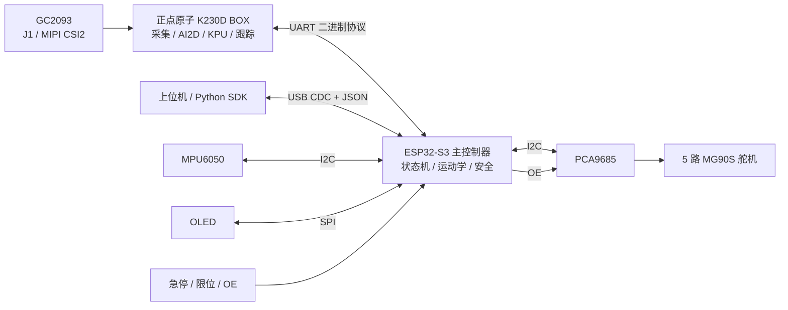
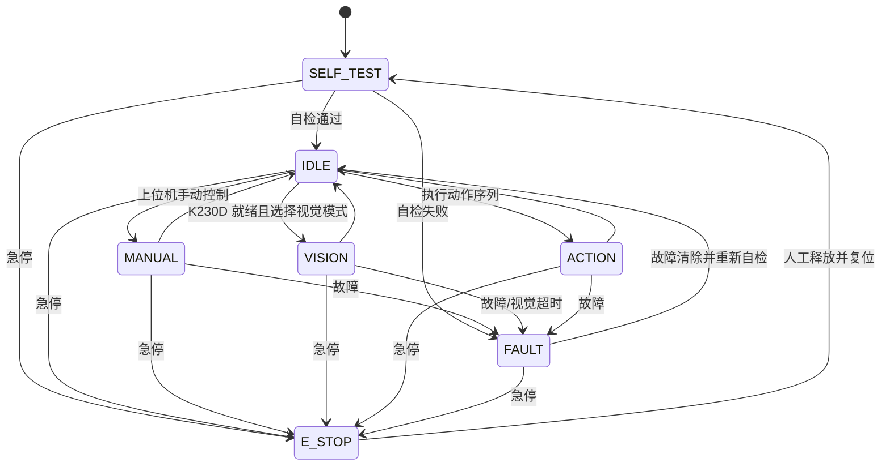

# CyberArm：基于正点原子 K230D BOX + ESP32-S3 的视觉机械臂系统设计

## 1. 修改结论

原开题报告采用“ESP32-S3 直接连接 OV2640，并在 ESP32-S3 上同时完成图像采集、视觉识别、运动控制和通信”的单控制器方案。改用 K230D 后，系统应调整为双处理器异构架构：

- K230D 是视觉处理器，负责相机采集、图像预处理、KPU 推理、目标跟踪和视觉结果输出。
- ESP32-S3 是主控制器，负责状态机、运动学、轨迹生成、舵机驱动、姿态传感、主机通信和全部安全逻辑。
- K230D 不直接控制舵机，只把带时间戳和置信度的目标信息发送给 ESP32-S3。

这项调整把高算力但非强实时的视觉任务与确定性的运动控制分离。即使 K230D 推理阻塞、串口断开或板卡重启，ESP32-S3 仍能关闭 PCA9685 输出并使机械臂进入安全状态。

> 已确认视觉板卡为正点原子 K230D BOX（ATK-DNK230D），由 DNK230D 底板和 CNK230DF 核心板组成，标配 GC2093 摄像头。下文接口选择以该板官方在线文档和 CanMV 固件为准。

## 2. 总体架构



### 2.1 处理器职责边界

| 功能 | K230D | ESP32-S3 |
| --- | --- | --- |
| 摄像头驱动与 ISP | 负责 | 不参与 |
| 图像缩放、色彩转换、裁剪 | 负责 | 不参与 |
| 人脸、手部、物体、手势推理 | 负责 | 不参与 |
| 目标跟踪和视觉侧滤波 | 负责 | 仅做控制侧限幅/滤波 |
| 坐标映射参数 | 保存视觉标定参数并输出标准化坐标 | 保存工作空间标定，计算关节目标 |
| 逆运动学、轨迹和舵机控制 | 禁止 | 负责 |
| PCA9685、MPU6050、OLED | 不连接 | 负责 |
| USB 上位机协议 | 可保留独立调试口 | 对外唯一业务接口 |
| 急停、故障处理、输出使能 | 只上报自身故障 | 最终裁决者 |

### 2.2 数据流

1. 摄像头图像进入 K230D 的视觉采集链路。
2. K230D 完成预处理、KPU 推理、后处理和短时跟踪。
3. K230D 发送目标类别、坐标、边界框、置信度、帧序号和时间戳。
4. ESP32-S3 检查 CRC、数据时效、模式、置信度和工作空间范围。
5. 通过验证后，ESP32-S3 才把目标位置转换为机械臂坐标，执行逆运动学和限速轨迹。
6. PCA9685 输出 50 Hz PWM，驱动四个关节舵机和一个夹爪舵机。

### 2.3 实际板卡资源

| 项目 | 正点原子 K230D BOX 资源 | 本项目用途 |
| --- | --- | --- |
| 主控 | K230D，1.6 GHz 大核 + 0.8 GHz 小核，内置 128 MB LPDDR4 | 运行 CanMV、图像管线和 KPU 推理 |
| 摄像头 | 标配 GC2093；两个接口分别连接 MIPI CSI1、MIPI CSI2 | 首版使用默认 J1/MIPI CSI2 接口 |
| 显示 | 2.4 英寸 640 × 480 触摸屏 | 本地显示相机画面、识别框、FPS 和链路状态 |
| 内部存储 | SD NAND，连接 MMC0 | 保存板卡专用 CanMV 固件、脚本、模型和标定文件 |
| 外部存储 | TF 卡槽，连接 MMC1 | 开发备份或替代启动，不作为首版运行必需项 |
| 业务串口 | PH2.0 接口 1：UART1/GPIO40～41；接口 2：UART2/GPIO44～45 | UART1 专用于 ESP32-S3，UART2 保留扩展 |
| 调试串口 | 背面 Type-C 经 CH342 连接 UART0、UART4，且不供电 | 仅调试，不作为板间业务链路 |
| 供电/IDE | 侧边 Type-C，USB OTG Device | 给 K230D BOX 供电并连接 CanMV IDE |
| 扩展 GPIO | GPIO14～25 共 12 路 | 后续可增加就绪/触发信号，首版不依赖 |

K230D BOX 尺寸约为 64.30 mm × 47.60 mm × 15.40 mm（不含突出件）。机械设计必须给侧边供电/IDE Type-C、背面调试 Type-C、摄像头视场和散热片留出空间。

## 3. 硬件方案修改

### 3.1 删除原有视觉连接

下列设计从主方案中删除：

- ESP32-S3 与 OV2640 之间的 DVP 数据线、PCLK、VSYNC、HREF 和 SCCB 连接。
- ESP32-S3 上的 `esp32-camera`、ESP-WHO、ESP-DL 视觉运行链路。
- 为相机占用的大量 ESP32-S3 GPIO 和 PSRAM 图像帧缓冲规划。

摄像头改为 K230D BOX 标配的 GC2093。首版保持出厂接法，使用 CNK230DF 核心板 J1，即官方例程默认使用的 MIPI CSI2 摄像头接口；另一组 MIPI CSI1 留作后续双摄扩展。软件使用 CanMV `Sensor` 模块的自动探测能力，初始化日志中记录实际匹配到的分辨率和帧率。

### 3.2 K230D 与 ESP32-S3 连接

第一版使用 K230D BOX 的 PH2.0 接口 1，将 GPIO40/41 复用为 UART1：

| 信号 | 方向 | 说明 |
| --- | --- | --- |
| `GPIO40 / UART1_TXD` | K230D → ESP32-S3 RX | 视觉结果和状态 |
| `GPIO41 / UART1_RXD` | ESP32-S3 TX → K230D | 模式、参数和控制命令 |
| `GND` | 双向公共参考 | 两块板必须共地 |
| PH2.0 `5V` | 不连接 | K230D BOX 与 ESP32-S3 分别供电，避免电源反灌 |

首版参数采用官方例程已经验证的 115200 bit/s、8N1、无硬件流控。结构化结果按每帧 64 B、30 FPS 估算，原始数据约 1.9 kB/s，低于 115200 bit/s 的有效吞吐，因此暂时不需要提高波特率。若后续数据量增加，再逐级验证 460800 或 921600 bit/s。

K230D BOX 端的最小 IOMUX 配置为：

```python
from machine import FPIOA, UART

fpioa = FPIOA()
fpioa.set_function(40, FPIOA.UART1_TXD)
fpioa.set_function(41, FPIOA.UART1_RXD)
vision_uart = UART(UART.UART1, baudrate=115200)
```

PH2.0 接口同时引出 5 V 电源，但官方在线页没有给出 UART 信号电平参数。接线前必须用板卡原理图或示波器确认 TX 空闲高电平；只有确认为 ESP32-S3 可接受的 3.3 V 逻辑时才可直连，否则加入双向电平转换。严禁把 PH2.0 的 5 V 电源脚接入 ESP32-S3 GPIO。

背面 Type-C 的 UART0/UART4 保留给启动日志和调试：UART0 被 RT-Smart 占用，UART4 经过 CH342 接到电脑，而且该 Type-C 不供电。业务通信不用这两个端口，避免日志与控制协议混流。

选择 UART 而不是共用 I2C 的原因：

- 不与 PCA9685、MPU6050 的控制总线互相影响。
- 任一处理器复位时更容易隔离并恢复通信。
- 有明确的帧边界、序号和 CRC 后，故障检测简单。
- 后续若确实需要传缩略图或高带宽数据，再单独评估 SPI，不影响第一版控制架构。

### 3.3 电源与接地

系统至少划分三个电源域：

| 电源域 | 负载 | 要求 |
| --- | --- | --- |
| 舵机 5 V | 5 路 MG90S、PCA9685 的 `V+` | 独立大电流 DC-DC，近端大容量电容，不经过开发板稳压器 |
| 控制逻辑 | ESP32-S3、PCA9685 `VCC`、MPU6050、OLED | 低噪声 5 V/3.3 V，避免舵机压降引发复位 |
| 视觉电源 | K230D BOX、GC2093、板载 LCD | 通过侧边 Type-C 独立供电；背面 Type-C 不能供电 |

三域共地，但采用星形回流：舵机大电流回路不穿过 ESP32-S3 或 K230D BOX 的地线。K230D BOX 运行时温度较高，整机持续运行必须安装包装内附带的散热片，并保证外壳附近有空气流通。

### 3.4 执行机构和传感器

保留原报告中的执行与感知部分：

- PCA9685：50 Hz，驱动 4 个关节 + 1 个夹爪。
- MG90S：每个通道单独标定最小脉宽、中位脉宽、最大脉宽和机械角度范围。
- MPU6050：通过 ESP32-S3 的 I2C 接入，用于姿态镜像模式或姿态辅助，不与视觉 UART 混用。
- OLED：通过 SPI 接入 ESP32-S3，显示模式、连接状态、目标置信度和故障码。
- PCA9685 `OE`：由 ESP32-S3 安全 GPIO 控制；上电和复位期间默认禁止输出。

K230D BOX 的 640 × 480 屏幕用于视觉画面和识别叠加，ESP32-S3 侧 OLED 用于独立显示运动状态与故障。两者职责不同：即使 K230D BOX 停止响应，OLED 仍能显示主控制器的故障状态。

## 4. 软件架构

### 4.1 K230D 视觉软件

首版直接使用 K230D BOX 出厂预装在 SD NAND 中的板卡专用 CanMV 固件和 MicroPython，不先迁移到通用 K230 SDK C/C++。更新固件时只能使用文件名形如 `CanMV-K230D_ATK_DNK230D_micropython_*_nncase_*.img` 的 SD NAND 镜像；不能混用其他厂商或其他板型镜像。视觉管线为：

```text
Sensor/ISP → 图像裁剪与缩放 → AI2D → KPU 推理
           → 后处理/NMS → 目标跟踪 → 坐标归一化 → UART
```

模型通过 nncase 转换为 `.kmodel`。模型版本、输入尺寸、量化方式和类别表必须作为一组版本化资产管理，不能只替换模型文件而不更新协议中的 `model_id`。

正点原子的资料已经提供摄像头、UART、人脸、手掌检测、手掌关键点分类、动态手势和 YOLOv8n 物体检测例程，因此视觉功能按以下优先级实现：

1. 人脸检测与中心点跟踪。
2. 手部检测 + 手部关键点，用食指关键点替代原方案中不稳定的肤色阈值指尖检测。
3. 指定颜色使用传统图像阈值与连通域；指定类别使用 YOLOv8n 物体检测，再增加短时跟踪。
4. 静态手势先复用手掌关键点分类例程；动态手势作为后续扩展，将结果转换为离散命令事件。

视觉处理器只输出“看到了什么、在哪里、可信度如何”，不输出舵机角度。

考虑 K230D BOX 只有 128 MB LPDDR4，首版沿用原报告的模式切换思路，一次只加载当前模式需要的模型，不同时常驻人脸、手部、物体和动态手势全部模型。最终自主运行时可以降低 LCD 叠加和 IDE 帧缓冲刷新频率，把资源优先留给推理和 UART。

### 4.2 ESP32-S3 控制软件

ESP32-S3 继续采用 PlatformIO + Arduino 框架，建议按模块拆分：

```text
src/
├── app/                 # 状态机和模式管理
├── control/             # 坐标映射、逆运动学、轨迹生成
├── vision_link/         # K230D UART 协议、时效检查、心跳
├── host_protocol/       # USB CDC JSON 和 Python SDK 协议
├── safety/              # 限位、超时、急停、OE、故障锁存
└── main.cpp             # 初始化与任务调度
```

现有 `PCA9685Servo` 库继续作为舵机驱动层使用。本文是设计修改，不要求现在改动 `main.cpp`。

### 4.3 任务周期

| 任务 | 建议周期/触发方式 | 运行位置 | 超时处理 |
| --- | --- | --- | --- |
| 舵机轨迹更新 | 20 ms（50 Hz） | ESP32-S3 | 立即故障锁存或保持安全位 |
| 安全检查 | 5–10 ms | ESP32-S3 | 关闭 `OE` |
| K230D 串口接收 | 事件驱动 | ESP32-S3 | 丢弃坏帧，不阻塞控制环 |
| 上位机协议 | 事件驱动 | ESP32-S3 | 返回错误，不影响控制环 |
| 图像采集与推理 | 尽可能连续，目标 ≥ 20 FPS | K230D | 上报降级状态 |
| 视觉心跳 | 100 ms | K230D | ESP 超时转入安全状态 |
| OLED 刷新 | 100–200 ms | ESP32-S3 | 可丢帧 |

控制环不得等待 K230D 响应。视觉结果通过无阻塞队列进入控制任务，只保留最新有效目标。

## 5. K230D—ESP32-S3 通信协议

### 5.1 帧格式

第一版使用小端二进制帧：

| 字段 | 长度 | 说明 |
| --- | ---: | --- |
| `SOF` | 2 B | 固定 `0xCA 0x23` |
| `version` | 1 B | 协议版本，首版为 `1` |
| `type` | 1 B | 消息类型 |
| `sequence` | 2 B | 每发送一帧递增 |
| `payload_len` | 2 B | 负载长度，上限 256 B |
| `payload` | N B | 消息负载 |
| `crc16` | 2 B | 从 `version` 到 `payload` 的 CRC-16/CCITT-FALSE |

接收端遇到错误长度或 CRC 错误时，从下一个 `SOF` 重新同步，不能无限等待当前帧。

### 5.2 消息类型

| 类型 | 方向 | 主要字段 |
| --- | --- | --- |
| `HELLO` | 双向 | 固件版本、协议版本、板卡 ID、模型 ID |
| `HEARTBEAT` | K230D → ESP | 运行时间、视觉状态、当前 FPS、错误码 |
| `SET_MODE` | ESP → K230D | `OFF/FACE/HAND/OBJECT/GESTURE`、参数版本 |
| `MODE_ACK` | K230D → ESP | 接收结果、实际模式、模型加载状态 |
| `TARGET` | K230D → ESP | 帧序号、时间戳、类别、置信度、中心点、边界框 |
| `GESTURE` | K230D → ESP | 手势 ID、置信度、事件序号、持续时间 |
| `SET_PARAM` | ESP → K230D | 阈值、ROI、跟踪参数、标定版本 |
| `STATUS` | 双向 | 当前状态和故障详情 |

坐标采用归一化定点数，`0..65535` 分别映射图像宽/高的 `0..1`，避免两侧对分辨率产生隐式依赖。每个目标必须包含采集时间戳，而不是只使用串口接收时间。

### 5.3 数据有效性规则

ESP32-S3 仅接受同时满足以下条件的视觉目标：

- 协议版本兼容且 CRC 正确。
- 消息模式与当前系统模式一致。
- 目标年龄不超过 150 ms（初始值，联调后实测调整）。
- 置信度不低于对应模式阈值。
- 连续目标跳变不超过设定速度；超出时按异常值处理。
- 映射后的机械臂坐标位于安全工作空间内，逆运动学存在有效解。

视觉心跳连续 300 ms 未更新时，ESP32-S3 停止跟踪；超过 1 s 时将视觉链路标记为故障。具体阈值要通过整机延迟测试确认。

## 6. 状态机和控制权

### 6.1 主状态机



K230D 另有视觉子状态 `OFF → BOOTING → READY → TRACKING`，以及 `DEGRADED/FAULT`。主状态机只有在视觉子状态为 `READY` 或 `TRACKING` 时才允许进入 `VISION`。

### 6.2 控制权优先级

控制命令优先级从高到低为：

1. 硬件急停和安全保护。
2. 故障锁存及 `OE` 关闭。
3. 上位机明确下发的停止/退出模式命令。
4. 当前激活模式产生的轨迹命令。
5. K230D 视觉目标。

K230D 的结果永远不能覆盖限位、最大速度、最大加速度、工作空间或急停约束。

## 7. 标定与坐标转换

相机固定在机械臂底座或外部支架上，减少视觉坐标系随关节运动变化造成的重复标定。对于桌面平面目标，采用以下转换：

```text
像素/归一化坐标 (u, v)
  → 相机畸变校正
  → 平面单应性矩阵 H
  → 机械臂基坐标 (x, y, z_plane)
  → 安全工作空间裁剪
  → 逆运动学
  → 关节限位与平滑轨迹
```

标定文件至少保存：图像尺寸、相机内参/畸变参数、单应性矩阵、机械臂原点、标定日期和版本号。ESP32-S3 与 K230D 启动握手时比较标定版本；版本不一致时禁止自动视觉控制。

若后续目标需要离开固定平面，仅靠单目中心点无法可靠得到深度，应增加已知尺寸估计、双目/深度传感器或限制任务为平面抓取，不能在报告中把单目二维坐标直接描述为完整三维定位。

## 8. 安全和故障策略

| 故障 | 检测方 | 系统动作 |
| --- | --- | --- |
| K230D 无心跳/重启 | ESP32-S3 | 退出视觉模式，减速停止并保持或回安全位 |
| 视觉结果过期/低置信度 | ESP32-S3 | 丢弃该结果，不更新目标 |
| UART CRC/长度错误 | 双方 | 丢帧并重新同步，累计错误计数 |
| 关节目标越界 | ESP32-S3 | 拒绝命令，记录故障 |
| 轨迹速度/加速度超限 | ESP32-S3 | 限速或中止轨迹 |
| 舵机电源异常或堵转 | ESP32-S3/硬件 | 关闭 `OE`，锁存故障 |
| 急停触发 | 硬件 + ESP32-S3 | 硬件优先关闭输出，软件进入 `E_STOP` |
| ESP32-S3 看门狗复位 | 硬件 | `OE` 默认保持关闭，重新自检后才允许输出 |

建议默认的视觉失联动作是“受控减速后保持”，不是继续使用最后一个视觉目标。若实际机械结构无法可靠保持，应改为减速回安全位，并通过实验确定策略。

## 9. 量化验收指标

| 类别 | 验收指标 |
| --- | --- |
| 视觉帧率 | 目标 ≥ 20 FPS；最低可接受值在实测后写入报告 |
| 视觉结果延迟 | 采集时间戳到 ESP 接收的 P95 ≤ 100 ms |
| 控制周期 | 50 Hz，周期抖动 P99 ≤ 2 ms |
| 通信可靠性 | 连续运行 2 h，无协议死锁；坏帧可自动重同步 |
| 失联保护 | K230D 断电后 300 ms 内停止接受视觉目标 |
| 定位精度 | 桌面平面 9 点测试，平均误差 ≤ 10 mm（根据机械精度实测修订） |
| 重复定位 | 同一点重复 20 次，末端标准差 ≤ 5 mm（根据舵机性能实测修订） |
| 安全 | 急停、越界、视觉过期、ESP 复位四类测试均不得产生继续追踪动作 |

指标中的阈值是设计目标，不应在未测试前作为已完成性能写入报告。答辩材料需要同时给出平均值、P95/P99、测试次数和测试环境。

## 10. 更新后的实施计划

### W0：板卡和接口验证

- 保持 GC2093 接在 CNK230DF 的 J1/MIPI CSI2，运行正点原子摄像头例程并记录自动匹配参数。
- 使用出厂 SD NAND CanMV 固件；确需升级时，只烧录 ATK-DNK230D 对应镜像。
- 在 PH2.0 接口 1 上把 GPIO40/41 配置为 UART1，先按 115200 bit/s 完成回环，再与 ESP32-S3 联调。
- 测量 UART1 信号电平，确认可直连后再制作固定线束；PH2.0 的 5 V 脚保持不连接。

### W1：视觉最小闭环

- 运行官方人脸检测示例并输出归一化目标坐标。
- 实现 `HELLO`、`HEARTBEAT`、`SET_MODE` 和 `TARGET` 四类消息。
- ESP32-S3 仅打印和验证结果，暂不驱动舵机。

### W2：运动控制闭环

- 完成五路舵机标定、关节限位、轨迹平滑和 `OE` 保护。
- 完成平面单应性标定与像素到机械臂坐标映射。
- 低速接入人脸/物体跟踪。

### W3：多模式和安全

- 增加手部关键点、手势和指定物体模式。
- 完成视觉过期、通信断开、K230D 重启、急停和堵转测试。
- 完成 USB JSON 协议与 Python SDK 的模式配置和状态查询。

### W4：性能优化与论文数据

- 测量 FPS、端到端延迟、控制抖动、定位误差和连续运行稳定性。
- 优化模型输入尺寸、量化和跟踪策略。
- 固化固件、模型、标定文件和测试记录的版本对应关系。

## 11. 开题报告逐节修改清单

| 原报告位置 | 应修改内容 |
| --- | --- |
| 第 1 章开头“功能设想” | 把“在 ESP32-S3 上完成检测、状态管理和运动控制”改为“K230D 完成检测，ESP32-S3 完成状态管理和运动控制” |
| 1.1 四个核心模块 | 重写“视觉感知”模块，增加 K230D 视觉处理器与板间通信；其余三个模块保留 |
| 1.2 五种交互模式 | 保留五种模式，但把前四种视觉模式的数据来源统一改为 K230D 结构化识别结果；指尖模式改用手部关键点 |
| 1.3 可编程是怎么实现的 | 保留 PC Python SDK；说明 ESP32-S3 是上位机唯一控制入口，K230D 由 ESP32-S3 配置模式 |
| 1.4 系统的几种工作状态 | 保留主状态机，给视觉追踪/手势响应增加“K230D 就绪”和“视觉结果未过期”进入条件 |
| 1.5 功能快速索引 | 表中四类视觉输入从“OV2640 图像”改为“K230D 视觉结果”；算法改为 KPU 模型、关键点、跟踪和后处理 |
| 2.1 总体思路 | ESP32-S3 自配置控制板保留；删除其相机接口和视觉帧缓冲职责，增加 ATK-DNK230D、独立 Type-C 视觉供电和 UART1 接口 |
| 2.2 接口与资源约束 | 删除 OV2640 DVP/SCCB 与 ESP-WHO 版本约束；写明 GC2093→J1/MIPI CSI2、UART1→GPIO40/41、UART2→GPIO44/45，以及 PH2.0 5 V 不接 |
| 2.3 关节配置 | 原设计基本不变，补充所有视觉目标仍必须经过关节限位和轨迹约束 |
| 2.4 传感器和外设 | 用“正点原子 K230D BOX + GC2093”替换 OV2640，增加板载 640 × 480 屏幕、侧边供电口和 PH2.0 UART1 |
| 2.5 机械结构 | 按 K230D BOX 约 64.30 × 47.60 × 15.40 mm 预留安装、插线和散热空间；保持相机相对底座不动 |
| 3.1 逆运动学 | 原设计保留；在求解前增加视觉坐标时效、标定版本和工作空间检查 |
| 3.2 视觉管线 | 整节重写为 Sensor/ISP → AI2D → KPU/`.kmodel` → 后处理/跟踪 → UART；删除 `esp32-camera`、QQVGA 和 ESP-WHO/ESP-DL |
| 3.3 JSON 协议 | 保留 USB JSON 作为上位机协议；追加 K230D—ESP32-S3 的二进制 UART 协议 |
| 3.4 双核任务划分 | 改为“双处理器任务划分”：K230D 跑视觉，ESP32-S3 跑 50 Hz 控制、通信与安全；控制环不得等待视觉 |
| 3.5 动作库 | 原设计保留，动作执行权仍在 ESP32-S3 |
| 3.6 安全措施 | 增加视觉心跳、过期结果丢弃、K230D 重启/失联降级和标定版本不一致禁止跟踪 |
| 4.1 总体方法 | 在每阶段出口中增加模型版本、板间协议和双板故障测试记录 |
| 4.2 W0 | 输入改为 CSI 图像、K230D 视觉结果、MPU6050 和上位机 JSON；增加板间通信时序要求 |
| 4.3 W1 | 系统框图增加 ATK-DNK230D、GC2093、UART1 和侧边 Type-C 视觉电源；软件分为 K230D 视觉层与 ESP32-S3 控制层 |
| 4.4 W2 | 删除 OV2640 SCCB/DVP 调试，改为 GC2093 预览、正点原子 AI 例程、UART1 回环和心跳测试 |
| 4.5 W3 | 数据链改为“K230D 视觉输入/上位机指令 → ESP 状态与目标 → 运动规划 → 舵机输出” |
| 4.6 W4 | 增加采集至控制的端到端 P95 延迟、UART 恢复和视觉失联保护指标 |
| 4.7 问题闭环 | 删除 ESP32 视觉占用问题，改为 ATK-DNK230D 固件/模型匹配、128 MB 内存、持续散热、双板延迟与电源干扰 |
| 4.8 预期交付物 | 改为“ESP32-S3 控制板 + 正点原子 K230D BOX + GC2093 + MPU6050 + OLED + 五路 MG90S”，删除 OV2640 专用成果描述 |

## 12. 可直接用于报告的总体方案摘要

本课题设计一种基于正点原子 K230D BOX 与 ESP32-S3 协同处理的桌面智能机械臂系统。系统采用感知、控制和执行分层架构：K230D BOX 使用标配 GC2093 摄像头，通过 J1/MIPI CSI2 采集图像，利用 CanMV、AI2D 与 KPU 完成人脸、手部关键点、物体及手势的检测和跟踪，并通过 PH2.0 接口 1 引出的 UART1（GPIO40/41），以带序号、时间戳和 CRC 校验的协议向 ESP32-S3 输出结构化视觉结果；ESP32-S3 作为系统主控制器，负责模式状态机、坐标标定、逆运动学、轨迹规划、PCA9685 舵机驱动、MPU6050 姿态采集、OLED 状态显示和 USB 上位机通信。机械臂采用四个关节舵机和一个夹爪舵机，ESP32-S3 对所有视觉目标进行时效性、置信度、工作空间和关节限位检查后才允许执行。系统通过独立电源域、PCA9685 输出使能、看门狗、急停和视觉失联降级机制，保证视觉处理异常时执行机构仍处于可控安全状态。

## 13. 已确认信息与尚需实测项目

已经从正点原子资料确认：板卡为 ATK-DNK230D、摄像头为 GC2093、默认接口为 J1/MIPI CSI2、业务串口选择 UART1/GPIO40～41、供电与 CanMV IDE 使用侧边 Type-C、背面调试 Type-C 不供电。

原理图和机械结构定版前还需要实测：

- 所持板卡的 PCB/核心板硬件版本与资料盘原理图版本。
- PH2.0 接口 1 的实际针脚顺序和 UART1 TX 空闲电平，确认是否需要电平转换。
- 侧边 Type-C 在 GC2093、LCD 和目标模型持续运行时的峰值电流与电源余量。
- 机械臂相机安装方式：固定俯视、斜视，或手眼相机。
- 桌面任务是否严格限定在一个平面；这决定二维单应性是否足够。
- 安装散热片后的连续运行温度和封装通风空间。

在这些信息确认前，可以先完成软件协议和两板 UART 联调，但不应直接定版线束和安装结构。

## 14. 官方资料依据

- [正点原子 K230D BOX 介绍与接口资源](https://wiki.alientek.com/docs/Boards/Kendryte/DNK230D/start-guide/k230d-box-introduction/)
- [正点原子 K230D BOX 摄像头实验](https://wiki.alientek.com/docs/Boards/Kendryte/DNK230D/example-base/camera/)
- [正点原子 K230D BOX UART 实验](https://wiki.alientek.com/docs/Boards/Kendryte/DNK230D/example-base/uart/)
- [正点原子 K230D BOX 固件烧录说明](https://wiki.alientek.com/docs/Boards/Kendryte/DNK230D/start-guide/firmware-flash)
- [正点原子 CanMV AI 开发框架](https://wiki.alientek.com/docs/Boards/Kendryte/DNK230D/example-ai/development_framework/)
- [正点原子手掌关键点分类实验](https://wiki.alientek.com/docs/Boards/Kendryte/DNK230D/example-ai/hand_keypoint_class/)
- [正点原子 YOLOv8n 物体检测实验](https://wiki.alientek.com/docs/Boards/Kendryte/DNK230D/example-ai/object_detect/)
- [K230/CanMV 官方快速入门](https://github.com/kendryte/k230_canmv_docs/blob/main/en/quick_start.md)
- [K230 CanMV UART API](https://github.com/kendryte/k230_canmv_docs/blob/main/zh/api/machine/K230_CanMV_UART%E6%A8%A1%E5%9D%97API%E6%89%8B%E5%86%8C.md)
- [K230 CanMV Sensor API](https://github.com/kendryte/k230_canmv_docs/blob/main/en/api/mpp/K230_CanMV_Sensor_Module_API_Manual.md)
- [K230 SDK 使用说明](https://github.com/kendryte/k230_docs/blob/main/en/01_software/board/K230_SDK_User_Manual.md)
- [K230 CanMV 教程与 nncase/KPU 部署](https://github.com/kendryte/k230_docs/blob/main/en/CanMV_K230_Tutorial.md)
- [K230 官方 AI Demo 列表](https://github.com/kendryte/k230_docs/blob/main/en/02_applications/ai_demos/K230_AI_Demo_Introduction.md)
- [K230 硬件设计指南](https://github.com/kendryte/k230_docs/blob/main/en/00_hardware/K230_Hardware_Design_Guide.md)
