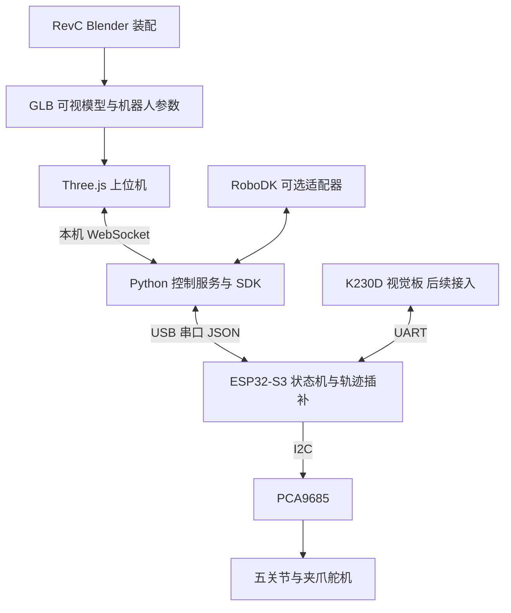

# CyberArm 上位机技术路线核验

核验日期：2026-09-14。范围：Dummy-Robot 官方仓库、RoboDK 官方文档、当前 CyberArm RevC 机械资料及本地固件。本文为路线评估；没有运行 DummyStudio、安装 RoboDK、连接实机或验证其运动表现。

后续状态：用户已确认现有五轴结构、接受姿态限制、允许改模型并要求先软件验证后打印。旧设计文档已被版本 2.0 覆盖，本文关于旧文档配置的描述仅记录初次核验时的情况。当前计划与问题状态见 [系统设计](CyberArm_设计文档.md) 和 [技术决策与问题记录](技术决策与问题记录.md)。

**建议：以现有 RevC 五关节机械臂为基础，自研 Three.js 3D 界面 + Python 控制服务 + ESP32-S3 运动固件；RoboDK 作为后续可选接入。可以实现相近的交互功能，但实机精度、反馈能力和可达姿态受现有结构与舵机限制。**

## 1. 作者实际使用的方案

作者说明视频中的仿真使用 RoboDK，并将机器人 Driver 从 TCP 接口改为串口、适配 Dummy 协议；另用 Unity3D 开发 DummyStudio，README 明确说上位机暂未开源。作者还描述了控制器侧正逆运动学、关节同步加减速和 CAN 驱动架构。因此只复刻窗口不能复刻整套运动能力。[作者说明](https://github.com/peng-zhihui/Dummy-Robot#关于上位机)

实际查看的 DummyStudio 目录包含 `DummyStudio.exe`、`UnityPlayer.dll`、`DummyStudio_Data`、`MonoBleedingEdge`，与 Unity Windows 发布包相符；本次没有取得可直接编辑的 Unity 工程，也没有确认支持任意机械臂模型的公开配置接口。不能将其当作可以直接替换模型的开源上位机框架。[软件目录](https://github.com/peng-zhihui/Dummy-Robot/tree/main/3.Software/DummyStudio)

RoboDK 的 Driver 负责在线通信；后处理器负责生成离线程序。要实现“软件中操作，实物跟随”，需要 Driver 或自定义 API 通信桥，仅更换后处理器不够。[官方 Driver 文档](https://robodk.com/doc/en/Robot-Drivers.html)

## 2. 当前项目真实起点

以 [mechanical 索引](../mechanical/README.md) 指定的 RevC 为当前机械基线，不采用旧版模型的轴数与舵机配置。

| 执行轴 | 当前模型 | 运动节点 |
|---|---|---|
| 底座回转 | MG996R | J01_Base_yaw |
| 肩关节 | MG996R | J02_Shoulder_pitch |
| 肘关节 | MG996R | J03_Elbow_pitch |
| 腕旋转 | MG90S | J04_Wrist_roll |
| 腕俯仰 | MG90S | J05_Wrist_pitch |
| 夹爪开合 | MG90S | 独立夹爪变量与四连杆联动 |

这是 **5 个运动关节 + 1 个夹爪执行轴**。夹爪开合不等于第六个末端姿态自由度。配置依据：[RevC 装配说明](../mechanical/arduino_reference_revC/ASSEMBLY_RevC_zh.md)。型号和数量以当前模型及已有记录为依据，本次没有重新核验实物库存。

已有的可复用内容：

- [RevC Blender 总装](../mechanical/arduino_reference_revC/Arduino_Replica_RevC_Connections.blend) 已有五关节层级、旋转轴和夹爪联动；比从打印 STL 重新组装更适合制作上位机资产。
- [运动脚本](../mechanical/scripts/revB_motion.py) 保留了关节零姿态及夹爪四连杆求解逻辑；[RevC 核算脚本](../mechanical/scripts/revC_stability_audit.py) 已按实际变换链计算运动学。
- [历史运动学交叉检查](../mechanical/arduino_reference_revC/audit_20260907/kinematic_crosscheck.json) 记录一个姿态的矩阵比较通过。该记录不是本轮重跑结果，也不等于全空间运动学或实物校准通过。
- [PCA9685Servo](../lib/PCA9685Servo/src/PCA9685Servo.h) 已封装 PWM 输出、反向和脉宽范围，可作为底层执行接口。

尚缺的核心功能：

- [main.cpp](../src/main.cpp) 仍是 PlatformIO 示例骨架，未实现通信、轨迹、状态机或机械臂控制。
- [早期系统设计文档](CyberArm_设计文档.md) 仍写“四关节、五路 MG90S”，与 RevC 不一致。其 USB JSON、Python SDK、视觉状态机属于设计描述，不能当作已实现功能。
- 没有现成的可运行 PC 上位机、统一机器人参数文件、五轴 IK、完整命令协议及实物标定表。

## 3. 哪些效果能做

| 目标效果 | 判断 | 必须处理的条件 |
|---|---|---|
| 真实外形的 3D 机械臂、旋转缩放视角 | 可实现 | 导出 RevC 可视资产，保留关节层级和正确单位 |
| 五关节滑块、夹爪开合、模型联动 | 可实现 | 使用模型本地旋转轴；重建夹爪四连杆约束 |
| 拖动末端位置，自动求关节角 | 可实现，但有可达范围 | 为五轴构型编写 IK，明确位置优先和姿态约束 |
| 关键帧、时间轴、轨迹预览与回放 | 可实现 | 软件示教；控制器进行限速与同步插补 |
| 实物跟随软件运动 | 有条件实现 | 六通道映射、实物零位和脉宽标定、轨迹固件 |
| 末端直线运动 MoveL | 分阶段实现 | 沿路径连续求解，检查整条路径的可达性、奇异性和碰撞 |
| 实际角度回读、拖动实物后模型同步 | 当前链路不支持 | 需要额外关节传感器或有反馈接口的执行器 |
| 任意 XYZ + 任意三维姿态 | 当前构型不能普遍满足 | 五运动轴不足以独立控制六维位姿 |
| 与原机相同的精度、刚度及高速表现 | 无依据承诺 | 执行器、传动、支承及打印结构不同，需要实测 |

MG996R/MG90S 的内部位置控制不等于 PC 可以读取输出轴角度。当前 PCA9685 控制接口只有输出，没有舵机角度回读。因此界面必须区分目标角 `q_target`、控制器插补指令角 `q_commanded` 和实测角 `q_measured`；当前最后一项应为空/不可用。ACK 表示命令被接收，插补结束也只能表示指令执行结束，不能证明实物准确到位。

现有 Blender 关节 ±30° 和夹爪 ±8° 是预览范围，不能写成真实安全限位。已有[载荷与结构复核](../mechanical/arduino_reference_revC/audit_20260907/结构载荷与电流复核_20260907.md) 也未给出经过实测确认的全行程额定载荷。

## 4. 路线比较

| 路线 | 适用性 | 本项目建议 |
|---|---|---|
| 直接用 DummyStudio 发布包 | 可用于观察交互；通用模型/协议适配能力未确认 | 不作为开发底座 |
| RoboDK + CyberArm Driver | 在线控制接口明确；可用其仿真与编程功能 | 作为可选工具，先验证五轴构型适配 |
| 自研 Unity 上位机 | 与作者相同渲染技术方向；运动学、通信仍需自行实现 | 可行备选，若后续主攻 Unity/VR 可考虑 |
| Three.js + Python + ESP32-S3 | 可直接定义五轴行为，便于制作中文控制界面及 Python SDK | 推荐主线 |

RoboDK 官方建模页列出六轴、七轴机械臂、SCARA 和多种机构，但未给出本机这种五轴串联臂的直接建模步骤。这是适配风险，不能据此断言 RoboDK 完全不能使用五轴机器人，也不能承诺导入 STL 即可获得正确 IK。官方所说“五轴加工”也不等于支持任意自制五轴机械臂求解。[官方建模说明](https://robodk.com/doc/en/General-Create-Mechanism-Robot.html)

若验证 RoboDK，先测试五个真实关节的 FK 和受约束 IK。必要时由自研运动学通过 API 更新可视对象，但这种方式不能自动获得原生机器人全部规划能力。不要增加一个虚拟可动轴，再忽略其输出去驱动实物。

RoboDK 官方说明免费版可进行很多入门操作，高级功能及复杂仿真保存需要许可证。具体使用范围应在选定功能后核验，不先购买许可证，也不将其作为无条件免费依赖。[官方基础指南](https://robodk.com/doc/en/Basic-Guide.html)

## 5. 推荐架构及关键约定

Three.js 已提供 GLTFLoader，可加载 glTF/GLB；Python 的 pySerial 提供串口访问。二者是可用基础组件，机械臂运动学和控制行为仍需本项目实现。[Three.js 文档](https://threejs.org/docs/pages/GLTFLoader.html)、[pySerial 文档](https://pyserial.readthedocs.io/en/latest/pyserial_api.html)

1. **模型与参数统一。** 导出显示用 GLB，同时保存每个关节的父节点、本地轴、零位变换、舵机通道、方向、标定脉宽、软限位及 TCP。内部统一米与弧度，界面显示毫米与角度。Blender 保存姿态、机械零位与舵机中位必须分别定义。GLB 不应被假定能执行 Blender 原生驱动表达式，夹爪连续联动需移植求解逻辑；烘焙动画只适合固定演示。
2. **五轴运动学。** 从现有实际变换链建立 FK；第一版 IK 以位置目标为主、姿态偏好为辅，再验证本机构可以独立控制的姿态约束。用上一姿态作为初值，加入关节限位和连续性约束，返回位置/姿态残差。不直接套用 Dummy 的六轴解析逆解，也不静默丢弃无法实现的姿态要求。
3. **服务与固件分工。** 第一版 PC 服务负责 IK、路径检查和可视预览；ESP32-S3 负责控制权、命令校验、速度/加速度限制、确定周期插补与 PWM。后续 K230D 若需要脱离 PC 的坐标抓取，再把同一运动学实现移植到 MCU。这样是对早期设计“全部 IK 在 MCU”的分阶段调整。
4. **轨迹而非逐帧直发。** UI 可争取 60 fps；舵机初始按 50 Hz PWM 验证，渲染刷新率不等于执行频率。MoveJ 使用各轴同起同止的轨迹时间；PC 发送完整目标/分段轨迹，MCU 按自身时钟执行，避免 USB 抖动影响插补。MoveJ 不保证末端直线。
5. **协议可扩展。** USB 按行 JSON，至少包含版本、命令 ID、关节数组、夹爪、运动时间/速度限制；响应区分接收、拒绝、插补结束、停止、故障。支持握手读取模型版本与反馈能力。重连不自动恢复旧动作，PC 和视觉输入由 MCU 统一裁决控制权。
6. **标定与停止。** 每路测量实际运动方向、装配零位和可用范围，必要时分段标定脉宽。现有库的 `writeAngle()` 按最小/最大脉宽线性映射，`centerPulseUs` 只用于 `center()`，不能当成已经完成机械零位映射。正常停止、通信中断停止、紧急失能分开定义；停止 PWM 不保证机械臂保持姿态。实物阶段需结合支承/固定方案验证停止行为。
7. **路径可执行性。** 限位、碰撞和可达性检查应覆盖插值路径，不只检查关键点。第一阶段可采用简化连杆碰撞体；通过模型检查不等于实物干涉验证通过。

## 6. 实施顺序与验收

| 阶段 | 交付 | 验收依据 |
|---|---|---|
| A：统一模型基线 | RevC 显示资产、机器人参数、五关节及夹爪映射 | 零姿态一致；多组单轴/组合姿态与 Blender 对照；单位及关节方向正确 |
| B：纯软件上位机 | 3D 视图、滑块、末端目标、IK、关键帧与轨迹播放 | 可达目标能回算；不可达目标明确报错；轨迹连续且受限；夹爪正确联动 |
| C：通信与运动固件 | 六通道控制、协议、插补、状态与标定页面 | 模拟设备先验证协议；随后单舵机低速标定、整臂小范围测试；断连/拒绝/停止行为正确 |
| D：实物联动验收 | 上位机驱动实物、时间轴回放 | 测量末端重复定位、迟滞、负载表现；明确显示指令姿态而非实测姿态 |
| E：扩展 | RoboDK 接入、K230D 视觉、更多动作 | 不绕过同一套限位与控制权机制；各项单独验收 |

进入实物阶段前需要确认：六个舵机的实际位置控制版本与可用角域、各通道接线及反向、供电和底座固定状态、各轴零位和装配行程、TCP 定义。它们不阻碍先完成软件仿真，但不能用模型推测值代替标定值。

下一步的具体工作应是阶段 A/B：把当前 RevC 做成可操作的五轴虚拟机械臂，先证明模型与运动学一致，再接实物。这样得到的资产、参数和控制服务也能供后续 RoboDK 适配使用。
