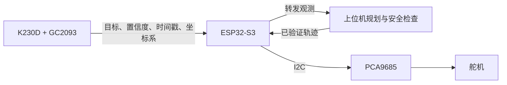

# CyberArm 上位机界面与实机调试手册

> 0.3.0 更新：单轴调试、实测映射和接线 JSON 已实现。旧 hwcal/hwcenter 流程及固定 600 ms 描述不再适用于新固件；请以[单轴标定与 JSON 接线使用说明](单轴标定与JSON接线使用说明_20260917.md)为准。
日期：2026-09-17

## 1. 界面与模式

上位机只保留两个操作模式：

| 模式 | 用途 | 默认路径显示 | 是否直接改变当前姿态 |
|---|---|---|---|
| 手动控制 | 单关节、夹爪或末端试摆；把满意的姿态记录到动作序列 | 关闭 | 是 |
| 自动运行 | 编辑目标、预览路径、检查并执行动作序列 | 开启 | 通过“执行”后改变 |

原“示教模式”的记录姿态功能已经并入手动控制。用户在手动模式把机械臂移动到目标姿态后，点击“记录当前姿态”即可形成关键帧；随后进入自动运行检查和执行整组动作。因此不再保留含义重叠的第三种模式。

“实机调试”是独立工具，不是运行模式。它负责连接、回中、校准和使能；完成调试后再回到手动或自动模式控制实体机械臂。打开实机调试时，如果正在执行运动，软件会先请求停止。

## 2. 顶部菜单

旧的第二横栏已经取消，功能按使用目的归入一层主菜单：

| 菜单 | 功能 |
|---|---|
| 项目 | 项目内容、导入项目、导出项目 |
| 模式 | 手动控制、自动运行、当前执行目标 |
| 工作区 | 动作序列、场景编辑 |
| 调试 | 实机调试、运动学诊断、命令控制台、运行记录 |
| 设置 | 系统设置、重置模拟状态 |
| 帮助 | 基本流程、快捷键、更新入口说明 |

右上角始终显示当前模式、上位机连接状态、仿真/实机状态和“停止”按钮。`Esc` 与顶部“停止”作用相同。停止是软件运动停止指令，不能代替舵机电源开关或独立急停链路。

命令控制台保持为浮动小窗，可拖动、拉伸和关闭，不会全屏遮住机械臂。缩小主窗口后，浮窗会限制在三维工作区内。

## 3. 实机调试工作台

入口：`调试 → 实机调试`。工作台按实际调试顺序分为五页。

### 3.1 连接与安全

用于枚举 USB 串口、连接 ESP32-S3、确认 PCA9685 是否就绪、查看协议版本和 PWM 状态。连接只做串口握手，不输出舵机 PWM。

连接前确认：

1. 舵机使用独立的额定电源，不能从 ESP32-S3 的 3.3 V 引脚取电。
2. ESP32-S3、PCA9685 和舵机电源负极共地。
3. PCA9685 的 VCC 接 3.3 V 逻辑电源，V+ 接舵机电源。
4. 当前默认 SDA 为 GPIO8，SCL 为 GPIO9，PCA9685 地址为 `0x40`，频率为 50 Hz。
5. 机械臂已支撑，运动范围内没有人、工具和障碍物，实体断电开关在手边。

预期连接结果：

- 控制器显示 ESP32-S3 型号和固件版本；
- PWM 驱动显示“PCA9685 就绪”；
- 输出显示“已关闭”；
- 连接、断开、重新连接不会使舵机突然运动。

### 3.2 单轴标定（原“回中与限位”）

2026-09-18 起使用五步工作台。当前操作以 [单轴调试操作手册](单轴调试操作手册_20260918.md) 为准，下文保留原设计背景。

该页保存六路舵机的负限位脉宽、中位脉宽、正限位脉宽和方向，并提供单路中位测试。轴号 1～6 对应 PCA9685 PWM0～PWM5，即 J1、J2、J3、J4、J5、夹爪 G。

普通 180° 三线 PWM 舵机不能主动报告当前角度。软件中的“回中”是向舵机发送已标定的中位脉宽，让舵机转到该位置；它无法在运动前读取舵机已经处于多少度。

首次回中必须逐路进行：

1. 关闭舵机 V+，拆下该轴舵盘或断开传动，并支撑连杆。
2. 只接入一个待测舵机，从保守脉宽 `1300 / 1500 / 1700 μs` 开始。
3. 在页面保存该路校准。勾选现场确认后点击“单路测试中位”。
4. 舵机稳定后，把舵盘装到最接近机械零位的齿位。
5. 点击“关闭当前 PWM 输出”，再调整舵盘或微调 `center_us`；不要带电拆装舵盘。
6. 用约 ±1° 的小动作检查方向。方向相反时先关闭输出，再修改“反向”并保存。
7. 以 5～10 μs 的小步进扩大范围；在机械限位、持续嗡鸣或电流明显上升前停止，并留出余量。
8. 对六路重复，断电重启后确认保存的校准仍然存在。

当前模型的 J1～J5 暂定为 ±30°，夹爪为 ±8°。页面中的负/正限位脉宽映射到这些模型限位，不等于舵机标称的完整 0°/180° 电气端点。

建议填写并长期保存以下实测表：

| 轴 | 通道 | 舵机型号 | `min_us` | `center_us` | `max_us` | 反向 | 机械负限位 | 机械零位 | 机械正限位 |
|---|---:|---|---:|---:|---:|---|---:|---:|---:|
| J1 | PWM0 |  |  |  |  |  |  |  |  |
| J2 | PWM1 |  |  |  |  |  |  |  |  |
| J3 | PWM2 |  |  |  |  |  |  |  |  |
| J4 | PWM3 |  |  |  |  |  |  |  |  |
| J5 | PWM4 |  |  |  |  |  |  |  |  |
| G | PWM5 |  |  |  |  |  |  |  |  |

### 3.3 运动测试

该页只有在以下三项都满足后才允许使能实机跟随：

- PCA9685 已就绪；
- 六路校准均已保存；
- 用户确认机械臂已支撑、舵盘已对中且现场安全。

使能后，仿真与实体接收相同的六轴目标、分段时间和插值曲线。推荐验证顺序：

1. 让仿真停在装配零位，空载并支撑实体机械臂。
2. 使能实机跟随（固件用 600 ms 斜坡从上次指令姿态过渡到当前仿真姿态），先只动 J1，按 +1°、-1°、+2°、-2° 检查。
3. 对 J2～J5 和 G 逐轴重复，确认方向与仿真一致，其他轴无异常抖动。
4. 把范围逐渐扩大到 ±5°；每步观察电流、电压、噪声、温度、线束和结构干涉。
5. 建立两个相距很小的姿态，在自动运行中先预览，再低速执行。
6. 分别验证暂停、继续、停止、USB 断连和重新连接；故障后必须重新显式使能。
7. 完成测试后关闭实机跟随并释放 PWM，再关闭舵机电源。

页面同时显示“指令角”和“实测角”。当前普通三线舵机只能显示指令角；实测角为“—”是正常行为。若需要知道负载下的真实角度、堵转和位置误差，需要增加关节绝对编码器，或换用支持位置回读的总线舵机。

### 3.4 通信

该页显示串口链路、固件版本、最近响应时间和反馈能力。更详细的信息可在 `调试 → 命令控制台` 查询：

```text
hwports
hwconnect COM5
hwstatus
device
events
```

常用实机命令：

| 命令 | 作用 |
|---|---|
| `hwconnect COM5` | 以默认 921600 baud 连接，不输出 PWM |
| `hwcal 1 1300 1500 1700 false` | 保存 J1 脉宽与方向 |
| `hwcenter 1 SUPPORTED` | 只输出 J1 的中位 |
| `hwarm SUPPORTED` | 六路校准后使能实机跟随 |
| `hwdisarm` | 关闭实机跟随并释放全部 PWM |
| `hwdisconnect` | 关闭 PWM 并断开串口 |
| `joint 1 3` | 把 J1 调到 3°；使能时同步实体 |
| `pose 3 0 0 0 0 1` | 检查后更新六路目标 |
| `movej 3 0 0 0 0 1 0.2` | 以低速度规划并执行六路关节运动 |
| `status` / `joints` | 查询仿真和执行状态 / 关节状态 |
| `pause` / `resume` / `stop` | 暂停 / 重新规划剩余动作 / 停止 |

`reset` 只是重置仿真状态，不是实体回零。实机使能时会拒绝该命令。

### 3.5 视觉

当前“视觉”页是 K230D 调试入口占位，不会建立视觉连接，也不会发出运动命令。后续应依次加入：设备连接、图像预览、相机内参、手眼标定、坐标变换、检测结果与延迟监视。

推荐链路为：



K230D 不直接输出舵机角度或 PWM。首个原型可用 3.3 V UART 连接 K230D 与 ESP32-S3；PC 与 ESP32-S3 继续使用 USB CDC JSONL，便于调试和抓包。线路变长或电机干扰明显时，优先使用带收发器的 CAN/TWAI 或 RS-485，并为数据增加长度帧、序号、CRC、超时和去重。视频保留在 K230D/PC 视觉链路，控制串口只传结构化检测结果与状态。

## 4. 运动学诊断

入口：`调试 → 运动学诊断`。该面板显示模型版本、当前逆解结果、模型关节范围，并可以生成或清除可达空间采样。

可达采样用于观察，不是实体安全认证。以下情况仍可能导致仿真可达而实体失败：舵盘零位偏差、方向配置错误、脉宽过宽、打印件干涉、舵机负载不足、供电压降、齿隙和模型尺寸误差。

## 5. 故障定位

| 现象 | 检查顺序 |
|---|---|
| 找不到串口 | USB 线是否支持数据、原生 CDC/下载口是否选对、设备管理器、串口是否被其他程序占用 |
| 连接失败 | 波特率 921600、固件是否启动、协议版本、串口是否在复位后变化 |
| `driver_ready=false` | PCA9685 VCC/GND、GPIO8/9、I2C 地址 `0x40`、焊接和共地 |
| 连接后舵机不动 | 这是正常安全行为；检查是否已校准并显式使能，V+ 是否接通 |
| 单路中位不动 | 通道映射、插头方向、校准是否保存、PWM 输出状态、舵机电源 |
| 中位偏差大 | 舵盘齿位、`center_us`、机构装配；软件无法读取普通舵机实际角度 |
| 方向相反 | 先关闭 PWM，再修改该轴“反向”；不要交换电源线 |
| 到端点嗡鸣发热 | 立即切断舵机 V+，收窄脉宽范围并检查机械干涉 |
| 舵机抖动或 ESP32 重启 | 电源电流不足、压降、共地不良、接头松动、信号线受干扰 |
| 仿真动、实体不动 | 顶部是否显示“实机跟随”，再查 `hwstatus` 的连接、校准、使能和故障状态 |
| 实体角度与仿真有误差 | 舵盘零位、舵机死区/齿隙、载荷与供电；用外部标尺测量后重标定 |
| 轨迹进入 `FAULT` | USB/心跳中断、电源棕断复位、串口占用、上位机后端状态 |

## 6. 每次上电检查表

- [ ] 机械结构、舵盘螺钉、线束和接头无松动。
- [ ] 舵机电源极性正确，保险丝和实体断电开关可用。
- [ ] ESP32-S3、PCA9685 和舵机电源共地。
- [ ] 机械臂已支撑，工作范围内无人和障碍物。
- [ ] 上位机连接后显示 PCA9685 就绪，PWM 初始关闭。
- [ ] 六路校准已加载，仿真初始姿态接近实体当前姿态。
- [ ] 先用单轴 ±1° 验证，再使能较大范围或自动动作。
- [ ] 自动动作已经预览通过，速度和负载适合当前试验。
- [ ] 停止按钮、舵机电源开关和独立急停手段均可立即触及。

更完整的分阶段验收、负载与耐久计划见 [软硬件联调计划](软硬件联调计划_20260916.md)；固件链路、看门狗和协议细节见 [实机同步控制](实机同步控制_20260916.md)；命令与 SDK 见 [控制台与通信接口](控制台与通信接口_20260915.md)。
