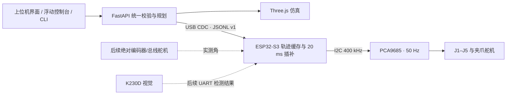

# 实机同步控制（0.5.0）

## 已实现的链路



上位机仍负责逆解、碰撞检查和路径规划。手动控制把通过检查的六轴目标发送给 ESP32-S3，固件用短五次曲线平滑跟随。规划执行会先上传全部轨迹段，最后发送共同启动延时；上位机与固件随后都按 20 ms 周期使用同一条五次曲线，避免把 Windows 调度或 USB 抖动直接传到舵机。

“相同运动”当前表示仿真和实体收到相同的关节目标、分段时间和插值曲线。普通三线 PWM 舵机不回传输出轴位置，因此软件不能证明实体已经到达，也不能测出堵转、齿隙、受载偏差和舵盘安装误差。`commanded_q_deg` 是固件正在输出的指令角，`measured_q_deg` 只有接入位置传感器后才会有值。

实体零件准备完成后，按 [软硬件联调计划](软硬件联调计划_20260916.md) 从不上电检查、单路回中开始执行，并逐项记录通过标准。

## 接线基线

| 连接 | 当前默认值 |
|---|---|
| ESP32-S3 → PCA9685 VCC | 3.3 V 逻辑电源 |
| ESP32-S3 → PCA9685 GND | GND，共地 |
| ESP32-S3 GPIO8 → PCA9685 SDA | `CYBERARM_I2C_SDA=8` |
| ESP32-S3 GPIO9 → PCA9685 SCL | `CYBERARM_I2C_SCL=9` |
| PCA9685 V+ | 独立舵机电源正极 |
| 舵机电源负极 | PCA9685 与 ESP32-S3 共地 |
| PCA9685 PWM0–PWM5 | J1、J2、J3、J4、J5、G |
| PCA9685 地址/频率 | `0x40` / 50 Hz |

GPIO8/9 是当前 DevKitC 固件的编译默认值，接线前要以手中的 ESP32-S3 板卡丝印和原理图为准，可在 `platformio.ini` 修改。舵机不能由 ESP32-S3 的 3.3 V 引脚供电；MG996R 启动和堵转电流较大，电源、导线、接头和保险必须按实际六路负载选型。建议把 PCA9685 OE 和舵机电源切断做成独立实体停止链路，软件停止不能代替断电。

## 烧录固件

PlatformIO 环境：`esp32-s3-devkitc-1`、Arduino、Adafruit PWM Servo Driver 3.x、ArduinoJson 7.x。

固件入口是 `src/main.cpp`，应用代码封装在 `lib/CyberArmFirmware`：`ServoSubsystem` 管理 PCA9685、校准和 NVS，`MotionController` 管理手动运动与轨迹状态机，`CommandProtocol` 管理 USB CDC JSONL 命令与状态应答，`CyberArmFirmware` 负责初始化、20 ms 调度和看门狗。该目录调整不改变协议、状态机或运动参数。

```powershell
# 编译
C:\Users\你的用户名\.platformio\penv\Scripts\platformio.exe run

# 把 COM5 换成开发板的烧录口
C:\Users\你的用户名\.platformio\penv\Scripts\platformio.exe run --target upload --upload-port COM5
```

固件启用了 ESP32-S3 原生 USB CDC。使用带原生 USB 的接口时，烧录后会出现串口；部分开发板另有 CH340/CP210x 接口，端口行为不同。若板型或 USB 接口不同，应调整 PlatformIO board/USB 选项，不能只按端口名称猜测。

启动时固件关闭全部 PWM。USB 连接和 `hello` 握手都不会让舵机动作。校准值保存在 ESP32-S3 NVS 中；六路未全部确认时 `arm` 会被拒绝。

## 舵机回中与舵盘安装

你的舵机标称 180°，但机械臂关节的零位和可动范围不等于舵机电气 0°/180°。当前模型临时限制为 J1–J5 ±30°、夹爪 ±8°。校准中的“负限位/中位/正限位”分别对应模型的负限位、0°、正限位，不是舵机完整 180° 的两端。

按以下顺序逐路完成，第一次不要让六路同时带载回中：

1. 关闭舵机 V+，拆下当前通道舵盘或断开它与机构的传动，并可靠支撑机械臂。
2. 烧录固件，接好 PCA9685，再接通额定舵机电源。
3. 在“调试 → 实机调试”的“连接与安全”页连接 ESP32-S3，再到“回中与限位”页保存保守脉宽，例如 `1300 / 1500 / 1700 μs`。这只是起点，不是已标定结果。
4. 勾选支撑确认，点击该通道“测试中位”。固件只给这一通道输出 `center_us`，其他通道保持关闭。也可在控制台输入 `hwcenter 1 SUPPORTED`。
5. 舵机稳定后，把舵盘以最接近机械零位的齿位装上；剩余小偏差通过微调 `center_us` 修正。完成后点击“断开并关闭输出”或运行 `hwdisarm`，再装紧螺钉。
6. 重新连接，用很小的目标变化（例如 ±1°～2°）确认方向。方向相反时关闭输出，勾选“反向”并重新保存。
7. 在机构支撑下逐渐测定模型负/正限位对应的安全脉宽。出现顶死、嗡鸣、发热或电源压降时立即断电并收窄范围。
8. 六路都保存后，才允许“使能实机跟随”。使能会把所有舵机移动到上位机当前姿态，因此使能前应让仿真停在装配零位并确认工作区安全。

普通 PWM 舵机断电后的角度未知。没有编码器时，“回中”只能是输出已标定的中位脉宽，让舵机主动转到该位置；软件无法先读取它当前在哪里。若舵盘已装好且机构可能碰撞，应先拆传动或逐轴支撑，不能直接执行全臂回中。

## 上位机与控制台

“调试 → 实机调试”完成连接、校准、单路中位、使能和关闭。顶部状态为“实机跟随”时，手动控制、自动运行、控制台和 CLI 共用同一条安全链路。手动模式仍默认只显示当前姿态，路径预览默认关闭。

新增命令：

| 命令 | 功能 |
|---|---|
| `hwports` | 枚举串口 |
| `hwconnect COM5` | 以 921600 baud 连接，不输出 PWM |
| `hwstatus` | 查询连接、驱动、校准、PWM、指令角和反馈能力 |
| `hwcal 1 1300 1500 1700 false` | 保存 J1 的负限位/中位/正限位脉宽和方向 |
| `hwcenter 1 SUPPORTED` | 支撑确认后只输出 J1 中位 |
| `hwarm SUPPORTED` | 六路校准完成后使能实机跟随 |
| `hwdisarm` | 关闭全部 PWM |
| `hwdisconnect` | 关闭 PWM 并释放串口 |

使能后，原有 `joint/grip/pose` 会同步手动目标，`movej/moveto/movel/execute` 会同步规划轨迹，`pause/stop` 会同时发送到固件。`reset` 在实机使能时被拒绝，因为它只是仿真状态重置，不是物理回零。

## 通信与失联行为

主机和固件使用 UTF-8 单行 JSON，最大请求 2048 字节，协议版本为 1，每条请求含递增 `id`，响应使用 `reply_to` 关联。已实现命令为 `hello/heartbeat/set_calibration/center_axis/arm/disarm/target/prepare/segment/commit/pause/stop`。

主机每 0.4 秒发送心跳。固件 1.5 秒没有收到有效消息时停止推进轨迹并进入 `FAULT`。整臂带载时保留最后 PWM，避免通信故障直接让机械臂坠落；单路中位测试超时会关闭 PWM。故障后必须重新连接并显式使能。实体电源开关仍是最终停止手段。

当前协议没有对运动命令做持久化去重，主机也不会自动重试丢失的运动命令。丢失响应后应先查询状态。若以后需要更长线路、更强抗干扰或多节点控制，建议改为 COBS/长度帧 + CRC 的二进制串口协议，或使用 ESP32-S3 TWAI/CAN 配外部收发器；当前 USB JSONL 更适合原型调试和抓包。

## K230D 接入方向

K230D 应发送带 `frame_id`、时间戳、置信度和坐标系的检测结果，不直接写舵机 PWM。原型可用 3.3 V UART 接到 ESP32-S3；图像仍在视觉侧处理，控制链路只传目标和状态。上位机完成相机内参、外参和手眼标定后，把像素/相机坐标转换为机械臂底座毫米坐标，再走现有 IK、碰撞检查、轨迹上传和执行流程。线路较长时可增加差分收发器或 CAN，不能让裸 UART 长线承担现场抗干扰。

## 当前验证边界

- PlatformIO 已编译通过模块化后的 ESP32-S3 固件，当前构建使用 RAM 37,880 B（11.6%）、Flash 307,529 B（9.2%）。
- Python 假串口测试覆盖握手、逐路校准、中位确认、使能、手动目标、分段轨迹、暂停、限位和断开；服务测试覆盖手动/规划/停止同步调用。
- 前端 TypeScript/Vite 生产构建通过，并保留可移动、可拉伸的非全屏控制台。
- 尚未在你的具体 ESP32-S3 板、PCA9685、舵机电源和实体机械臂上烧录测量。GPIO、通道、方向、脉宽、机械限位、负载误差和停止行为都要按上述逐轴流程确认。
