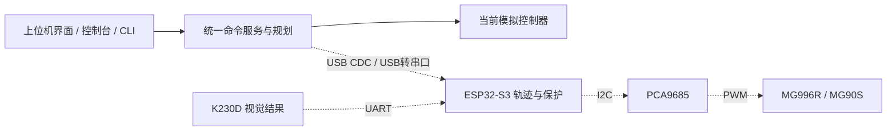

# 控制台与通信接口（0.4.0）

> 0.5.0 已在同一命令网关加入 ESP32-S3 实机同步，命令总数增至 27。固件、接线、回中和校准流程见 [实机同步控制](实机同步控制_20260916.md)。本文件保留 0.4.0 控制台与本地 API 的设计记录。

## 使用入口

打开 `desktop/dist/console/win-unpacked/CyberArm Studio.exe`，选择工具栏“控制台”。控制台默认是视图左下角的小浮窗，拖动标题栏移动，拖动右下角拉伸。关闭再打开保留本次窗口位置、大小及历史；缩小应用窗口时自动限制在机械臂视图内，避免丢失窗口或覆盖固定控制区。聚焦移动/缩放手柄后也可用方向键微调，Shift 为 1 像素步长。

命令窗口与三维视图共用同一个控制服务。回车执行，上下键查看本次会话最近 100 条历史，Tab 补全唯一命令，`clear` 清屏。关闭应用不保存历史。底部停止和 Esc 始终可用。操作说明默认折叠，可点击“控制 · ° / mm · help 查看命令”展开。

状态仍以仿真运动学为界面来源，同时包含 `hardware` 实机状态。`device` 会显示 ESP32-S3/PCA9685 的实时连接和使能情况；普通舵机的 `measured_feedback` 仍为 false，不能从指令角推断真实舵机位置。

| 命令 | 用途 |
|---|---|
| `help` / `help movej` | 全部命令 / 指定命令帮助 |
| `status` | 模式、关节、TCP、规划状态、错误、场景 |
| `joints` / `tcp` | 关节角度 / TCP 位置与工具方向 |
| `limits` / `events` / `device` | 模型限制 / 运行记录 / 通信能力 |
| `hwports` / `hwstatus` | 串口列表 / ESP32-S3、PWM、校准和反馈状态 |
| `hwconnect COM5` / `hwdisconnect` | 连接（不输出 PWM）/ 关闭 PWM 并断开 |
| `hwcal 1 1300 1500 1700 false` | 保存一路负限位、中位、正限位脉宽及方向 |
| `hwcenter 1 SUPPORTED` | 支撑确认后测试单路中位 |
| `hwarm SUPPORTED` / `hwdisarm` | 显式使能实机跟随 / 关闭全部 PWM |
| `joint 1 3` | 将 J1 设置为 3°；索引 1–5 是关节，6 是夹爪 |
| `grip 1` | 设置夹爪驱动角度为 1°，不是夹爪开口毫米数 |
| `pose 3 0 0 0 0 1` | 设置整组仿真姿态，检查整段连接路径后立即更新 |
| `movej 3 0 0 0 0 1 0.5` | 规划并执行关节运动，速度比例 0.5 |
| `moveto 270 13 55 0.5` | 规划并执行点到点运动，坐标为底座系 mm；示例目标不保证可达 |
| `movel 270 13 55 0.5` | 规划并执行末端直线运动，同样先检查 |
| `plan {"steps":[{"kind":"joint","q_deg":[3,0,0,0,0,0]}],"speed":0.5}` | 只规划；支持 joint / cartesian / linear / wait 序列 |
| `execute <plan_id>` | 执行同一客户端的有效规划 |
| `pause` / `resume` | 减速暂停 / 重新检查剩余路径后立即继续 |
| `stop` | 停止，取消旧规划及正在计算但未应用的结果 |
| `reset` | 重置模拟状态，运动中拒绝；不是实物回零 |

`movej/moveto/movel` 可省略速度，默认为 0.7；范围为 0.05–1。六个角度总是 J1–J5、G，单位度。结构化 `moveto/movel` 参数还可提供非零 `direction` 三维向量，约束工具 Z 方向。模型是五轴，不保证任意六维姿态。

`joint/grip/pose` 是仿真手动姿态更新，复用限位、端点及整段碰撞检查，不播放速度曲线。`movej/moveto/movel/execute/resume` 使用带速度约束的轨迹执行。两者在真实硬件适配时必须区分：手动目标也应由固件限速插补，不能把仿真瞬时更新直接变成 PWM 跳变。

界面收到命令造成的状态变化后更新当前姿态；手动模式路径显示仍默认关闭。`plan` 返回的路径在显式开启预览时可查看。控制台成功响应表示命令已接受，运动完成需查看 `status.execution` 的规划 ID 和 `completed/paused/stopped` 状态，不能仅凭 READY 判定完成。CLI 单条运动也按此判断，停止或被其他运动替换返回非零退出码。

## 终端 CLI 与 SDK

桌面后端使用动态端口。复制内置控制台显示的 URL；独立开发服务默认 `http://127.0.0.1:8765`。

```powershell
# 在仓库根目录；58430 仅为端口示例
simulator/.venv/Scripts/python.exe simulator/sdk/cyberarm_cli.py --url http://127.0.0.1:58430
simulator/.venv/Scripts/python.exe simulator/sdk/cyberarm_cli.py --url http://127.0.0.1:58430 -c "status" --json
simulator/.venv/Scripts/python.exe simulator/sdk/cyberarm_cli.py --url http://127.0.0.1:58430 -c "movej 3 0 0 0 0 0"
simulator/.venv/Scripts/python.exe simulator/sdk/cyberarm_cli.py --url http://127.0.0.1:58430 --watch 0.5 --json
```

交互模式输入 `quit` 或 `exit` 退出，释放本客户端控制权并请求暂停；不会暂停其他客户端的运动。单条运动命令及管道输入会保持心跳、等待运动结束。退出码 0 成功，2 命令拒绝/暂停未完成，3 连接错误，130 用户中断。`--json` 输出每条响应一行 JSON。管道模式遇到错误即停止，不继续后面的运动。

规划归属于客户端，120 秒后失效；状态或场景变化也会使它失效。不要分别启动两个 `-c` 进程进行 `plan` 和 `execute`；使用同一交互会话、同一 SDK 对象，或直接 `movej`。

```python
from simulator.sdk.cyberarm_sdk import CyberArm, CommandError

with CyberArm('http://127.0.0.1:58430') as arm:
    print(arm.command('status')['data'])
    arm.command(name='joint', args={'index': 1, 'angle_deg': 3})
    plan = arm.preview([{'kind': 'joint', 'q_deg': [5, 0, 0, 0, 0, 0]}])
    arm.execute(plan)
    # 在此查询 arm.state()，等待 READY；退出 with 会暂停仍在执行的本客户端运动。
```

SDK `Transport` 定义 `get/post/close`，默认 `HttpTransport`。真实串口由后端 `HardwareBridge` 统一持有，UI 与 CLI 都通过本地 API 操作，避免两个进程争抢串口；SDK 不直接打开串口。连接和校准可通过实机面板或 `hw*` 命令切换。

## 本地 API v1（已实现）

- `GET /api/commands`：由唯一命令注册表生成语法、说明、是否修改状态和参数 JSON Schema。
- `POST /api/command`：使用原有 `/api/bootstrap` 返回的会话值作为 `X-Session`，固定 `X-Client` 标识调用方。SDK 自动办理。
- `POST /api/heartbeat`：SDK 每 0.4 秒续约；原控制器超过 1.5 秒失联自动减速暂停。GUI 用 WebSocket ACK 续约。
- `POST /api/release`：只暂停当前客户端拥有的运动。
- `GET /api/state` 和 `/ws`：保留已有完整状态接口。

```json
{"protocol_version":1,"request_id":"example-001","command":"joint","args":{"index":1,"angle_deg":3}}
```

等价文本请求：`{"protocol_version":1,"request_id":"example-002","text":"joint 1 3"}`。只能二选一。响应含 `protocol_version/request_id/command/ok/elapsed_ms`，成功有 `data`，失败有 `error: {code,message}`。参数/限位错误 422，忙或过期 409，并发手动更新 429。

命令执行失败仍通过 HTTP 200 返回 `ok:false`；会话拒绝和外层请求格式错误用 HTTP 403/422。调用者必须检查 `ok`，SDK 会抛出 `CommandError`。`request_id` 当前用于关联请求和响应，不提供去重执行保证；客户端不自动重试运动。超时或丢响应先查询状态，不能盲目重发。

此 HTTP 服务只用于本机，桌面端绑定 127.0.0.1；会话机制不等同于远程网络鉴权。不应直接将它暴露到局域网。后续网络传输需另行设计认证、授权和链路安全。

## 实物通信结构



推荐先使用 USB 串口。ESP32-S3 内置 USB Serial/JTAG 的 CDC-ACM 可以提供串口，不一定需要外部 USB-UART 芯片；实际使用原生 USB 还是板载桥接芯片，须核对当前开发板 USB 口与固件配置。[Espressif 官方说明](https://docs.espressif.com/projects/esp-idf/en/stable/esp32s3/api-guides/usb-serial-jtag-console.html)

K230D 优先通过 UART 向 ESP32-S3 发送检测结果、置信度、时间戳与坐标系信息，ESP 再转发给上位机。视觉模块不直接写舵机 PWM。引脚和电平要按实板核对，不能照搬其他 K230 板的引脚号。[嘉楠 UART 示例](https://www.kendryte.com/k230_canmv/en/v1.2/example/peripheral/uart.html)

嘉楠当前文档明确说明 K230D 不支持网络功能，网络与 RTSP 示例无法运行。因此本方案不假定 K230D 有以太网、Wi-Fi 或可直接传 RTSP 视频。[嘉楠网络限制](https://www.kendryte.com/k230_canmv/en/main/example/network/index.html)

如果后续线路较长、干扰明显或增加多个控制节点，可以评估 CAN/TWAI；ESP32-S3 需要外接收发器，不是把两根 GPIO 接出去即可。[Espressif TWAI 文档](https://docs.espressif.com/projects/esp-idf/en/stable/esp32s3/api-reference/peripherals/twai.html) 对当前桌面六舵机原型，先用 USB + UART 接入更容易调试。大图像另走已验证的视频通道，控制链路只传结果与状态。

### 固件协议状态

0.5.0 已实现 USB CDC JSONL v1、校准、使能、手动目标、轨迹缓存、同步启动、暂停/停止和心跳看门狗。以下较完整约定中，会话 ID、持久去重、真实反馈、视觉帧和实体停止输入仍是后续工作：

1. 先做 `hello/capabilities` 协商版本、固件、设备 ID、标定版本及反馈能力，未标定不接受实物运动。
2. USB/UART 原型可用 UTF-8 单行 JSON，建议固定最大帧 4096 字节并处理半包、粘包、超长包；日志与协议分通道或使用独立 `type:log` 帧，禁止夹杂无类型打印。
3. 每帧带版本、会话 ID、递增序号/命令 ID；固件缓存同一会话已处理 ID，重复请求返回原 ACK，不重新运动。这个硬件去重机制还未实现。
4. 区分 `accepted/completed/rejected/fault`，带错误码和关联命令 ID；ACK 只说明接收，不能说明舵机到位。重连建立新会话，清除待发送队列，不自动续跑。
5. 状态区分 `commanded_q_deg`、有真实传感器时才提供的 `measured_q_deg`、电源/故障、控制器时间及通信新鲜度。现有普通 PWM 舵机链路没有位置回传，PCA9685 输出值也不是位置测量。
6. 主机下发经过验证的轨迹段，ESP 按自己的时钟插补，进行标定映射、限位/速度/加速度检查并更新 PCA9685。不能依赖上位机刷新率维持舵机时序。
7. 固件独立看门狗处理失联；暂停、停止、故障和掉电策略根据带载机构验证，普通 stop 不等同于硬件急停或切断舵机电源。
8. 视觉帧包含 `frame_id/timestamp/confidence/frame`，像素坐标先经相机和手眼标定转换到底座 mm；过期或坐标系不明的数据拒绝参与运动规划。

## 验证

后端命令测试覆盖文本/结构化一致性、未知字段、NaN/Inf、越界、整段碰撞、规划归属/失效、运动中拒绝、停止取消规划、暂停/继续、SDK 心跳和退出、真实本地 HTTP 下的 CLI 退出码。桌面测试覆盖命令操作、历史/补全、界面同步、预览默认关闭和 960×720 布局。没有进行实物串口、舵机或视觉模块验证。

2026-09-15 验证结果：`pytest simulator/tests -q` 共 34 项通过；C++ CTest 1 项通过；最终 Windows 独立程序的 5 个桌面用例均通过（控制台、生命周期、手动工作台、项目一致性、末端试摆）。新增折叠帮助后，项目一致性旧测试的通用 summary 定位产生歧义，已改为明确选择“方向与运动选项”，单独复测通过。浮窗测试包含实际鼠标拖动、拉伸、关闭重开后保持位置，以及缩小主窗口后边界约束。

2026-09-16 实机同步验证：Python 共 37 项通过；ESP32-S3 固件由 PlatformIO 编译通过；前端生产构建、C++ CTest 和 Windows 独立程序的 5 个桌面用例通过。桌面测试确认打包后端能够调用 pyserial 枚举串口。实体板卡、PCA9685、电源、舵机负载与角度精度仍待逐轴实测。
